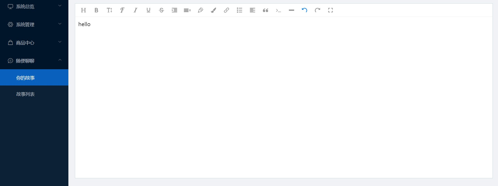
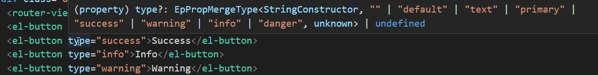
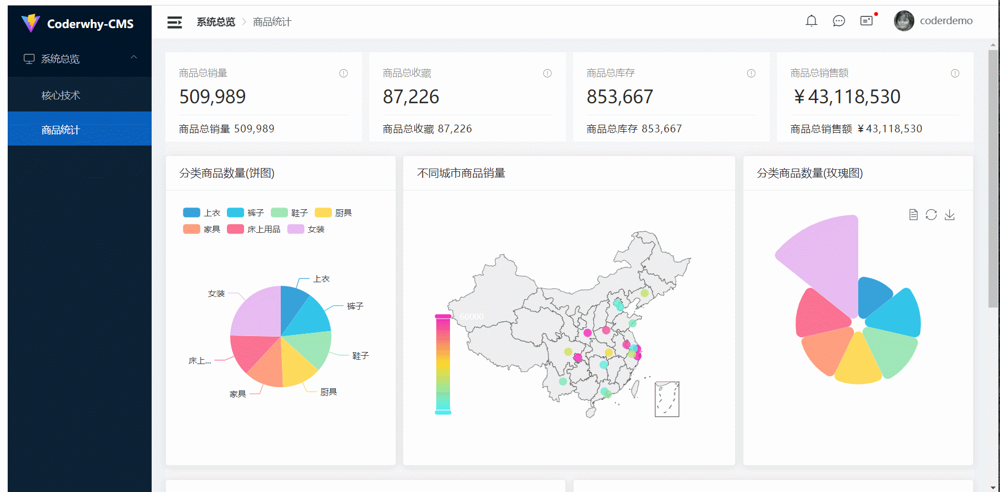
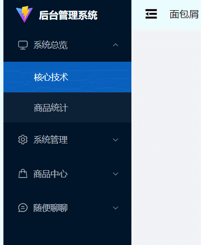
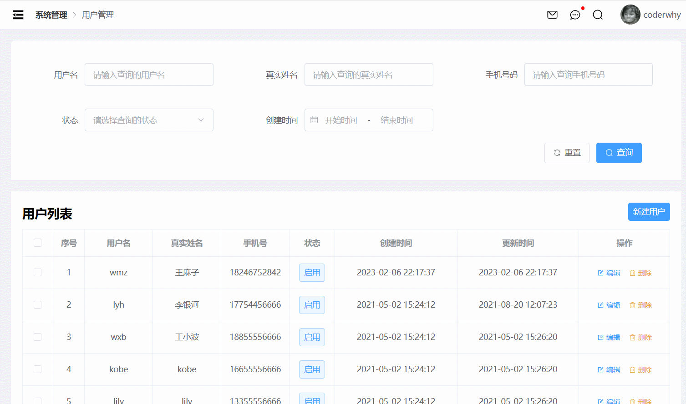
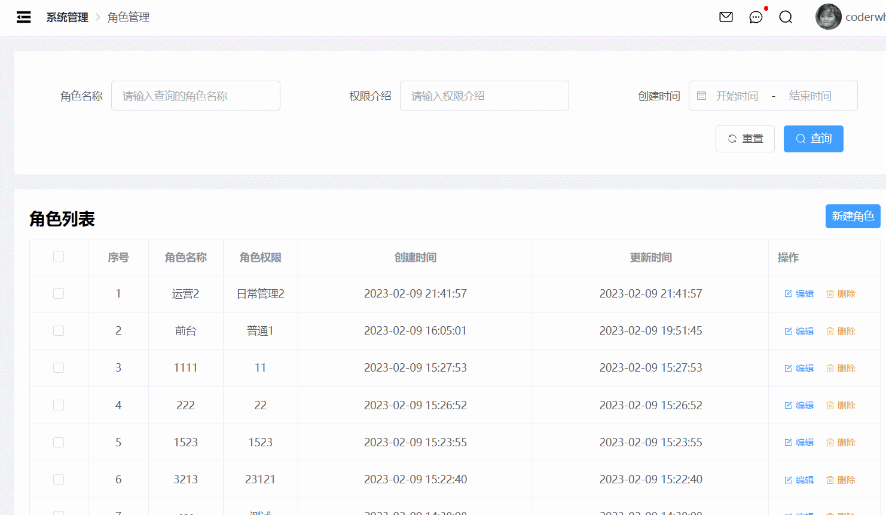

# vue3-ts-admin

## 大致效果

本项目是基于Vue3 + TS + Vite + Pinia 实现的一个后台管理系统，大致的功能点有：权限控制，登录不同账号系统会显示不同的菜单栏、常见的增删改查、Element-plus的使用、Echarts5.x的基本使用、富文本编辑器的使用等

在该项目中将主要采用组件化、模块化的思想

**大致效果如下：**





## 项目创建


创建完成之后删除不必要的文件及资源


## 接口文档说明

**接口文档v1版本：**

https://documenter.getpostman.com/view/12387168/TzsfmQvw

baseURL的值：

```
http://152.136.185.210:5000
http://152.136.185.210:4000
```

设置全局token的方法：

```js
const res = pm.response.json();
pm.globals.set("token", res.data.token);
```


**接口文档v2版本：（有部分更新）：**

https://documenter.getpostman.com/view/12387168/TzzDKb12


## 项目中常见配置文件说明

TypeScript 使用 tsconfig.json 文件作为其配置文件，当一个目录中存在 tsconfig.json 文件，则认为该目录为 TypeScript 项目的根目录

### tsconfig.json

```json
{
  // 继承
  "extends": "@vue/tsconfig/tsconfig.web.json",
  // 告知TS哪些文件需要编译
  "include": ["env.d.ts", "src/**/*", "src/**/*.vue"],
  // 编译选项
  "compilerOptions": {
    // 配置路径别名，利于VSCode代码提示和读取
    "baseUrl": ".",
    "paths": {
      "@/*": ["./src/*"]
    }
  },

  // 引用
  "references": [
    {
      "path": "./tsconfig.config.json"
    }
  ]
}
```

在项目中创建好项目后，一般不建议去修改 tsconfig.json  文件，表示比较固定的了已经

但是如果在项目中确实有一些文件配置要单独去配置，建议在 tsconfig.config.json 文件里进行修改


### tsconfig.config.json

```json
{
  // 继承
  "extends": "@vue/tsconfig/tsconfig.node.json",
  // 告知TS哪些文件需要编译
  "include": ["vite.config.*", "vitest.config.*", "cypress.config.*", "playwright.config.*"],
  // 编译选项
  "compilerOptions": {
    "composite": true,
    "types": ["node"]
  }
}
```


### 集成editorconfig配置

EditorConfig 有助于为不同 IDE 编辑器上处理同一项目的多个开发人员维护一致的编码风格。

.editorconfig

```yaml
# http://editorconfig.org

root = true

[*] # 表示所有文件适用
charset = utf-8 # 设置文件字符集为 utf-8
indent_style = space # 缩进风格（tab | space）
indent_size = 2 # 缩进大小
end_of_line = lf # 控制换行类型(lf | cr | crlf)
trim_trailing_whitespace = true # 去除行尾的任意空白字符
insert_final_newline = true # 始终在文件末尾插入一个新行

[*.md] # 表示仅 md 文件适用以下规则
max_line_length = off
trim_trailing_whitespace = false
```

VSCode需要安装一个插件：EditorConfig for VS Code


### 使用prettier工具

.prettierrc.json

Prettier 是一款强大的代码格式化工具，支持 JavaScript、TypeScript、CSS、SCSS、Less、JSX、Angular、Vue、GraphQL、JSON、Markdown 等语言，基本上前端能用到的文件格式它都可以搞定，是当下最流行的代码格式化工具。

1.安装prettier

```shell
npm install prettier -D
```

2.配置.prettierrc文件：

* useTabs：使用tab缩进还是空格缩进，选择false；
* tabWidth：tab是空格的情况下，是几个空格，选择2个；
* printWidth：当行字符的长度，推荐80，也有人喜欢100或者120；
* singleQuote：使用单引号还是双引号，选择true，使用单引号；
* trailingComma：在多行输入的尾逗号是否添加，设置为 `none`，比如对象类型的最后一个属性后面是否加一个，；
* semi：语句末尾是否要加分号，默认值true，选择false表示不加；

```json
{
  "useTabs": false,
  "tabWidth": 2,
  "printWidth": 80,
  "singleQuote": false,
  "trailingComma": "none",
  "semi": true
}
```

3.创建.prettierignore忽略文件

```
/dist/*
.local
.output.js
/node_modules/**

**/*.svg
**/*.sh

/public/*
```

4.VSCode需要安装prettier的插件


5.VSCod中的配置

- settings =>format on save => 勾选上
- 
- settings => editor default format => 选择 prettier
- 

6.测试prettier是否生效

* 测试一：在代码中保存代码；
* 测试二：配置一次性修改的命令；

在package.json中配置一个scripts：

```json
"prettier": "prettier --write ."
```


### .eslintrc.cjs

使用ESLint检测

1.在前面创建项目的时候，我们就选择了ESLint，所以Vue会默认帮助我们配置需要的ESLint环境。

2.VSCode需要安装ESLint插件：


3.解决eslint和prettier冲突的问题：

安装插件：（vue在创建项目时，如果选择prettier，那么这两个插件会自动安装）

```shell
npm install eslint-plugin-prettier eslint-config-prettier -D
```

添加prettier插件：.eslintrc.cjs

```json
module.exports = {
  root: true,
  extends: [
    "plugin:vue/vue3-essential",
    "eslint:recommended",
    "@vue/typescript/recommended",
    "@vue/prettier",
    "@vue/prettier/@typescript-eslint",
    "plugin:prettier/recommended"
  ],
  parserOptions: {
    ecmaVersion: "latest"
  },
  rules: {
    "@typescript-eslint/no-unused-vars": "off"
  }
};
```

4.VSCode中eslint的配置（在react里）

```json
"eslint.lintTask.enable": true,
"eslint.alwaysShowStatus": true,
"eslint.validate": [
    "javascript",
    "javascriptreact",
    "typescript",
    "typescriptreact"
],
"editor.codeActionsOnSave": {
    "source.fixAll.eslint": true
},
```


### git Husky和eslint

虽然我们已经要求项目使用eslint了，但是不能保证组员提交代码之前都将eslint中的问题解决掉了：

* 也就是我们希望保证代码仓库中的代码都是符合eslint规范的；

* 那么我们需要在组员执行 `git commit ` 命令的时候对其进行校验，如果不符合eslint规范，那么自动通过规范进行修复；

那么如何做到这一点呢？可以通过Husky工具：

* husky是一个git hook工具，可以帮助我们触发git提交的各个阶段：pre-commit、commit-msg、pre-push

如何使用husky呢？

这里我们可以使用自动配置命令：

```shell
npx husky-init && npm install
```

**这里会做三件事：**

1.安装husky相关的依赖：


2.在项目目录下创建 `.husky` 文件夹：


3.在package.json中添加一个脚本：


接下来，我们需要去完成一个操作：在进行commit时，执行lint脚本：


这个时候我们执行git commit的时候会自动对代码进行lint校验。


### git commit规范

#### 代码提交风格

通常我们的git commit会按照统一的风格来提交，这样可以快速定位每次提交的内容，方便之后对版本进行控制。


但是如果每次手动来编写这些是比较麻烦的事情，我们可以使用一个工具：Commitizen

* Commitizen 是一个帮助我们编写规范 commit message 的工具；

1.安装Commitizen

```shell
npm install commitizen -D
```

2.安装cz-conventional-changelog，并且初始化cz-conventional-changelog：

```shell
npx commitizen init cz-conventional-changelog --save-dev --save-exact
```

这个命令会帮助我们安装cz-conventional-changelog：


并且在package.json中进行配置：


这个时候我们提交代码需要使用 `npx cz`：

* 第一步是选择type，本次更新的类型

| Type     | 作用                                                         |
| -------- | ------------------------------------------------------------ |
| feat     | 新增特性 (feature)                                           |
| fix      | 修复 Bug(bug fix)                                            |
| docs     | 修改文档 (documentation)                                     |
| style    | 代码格式修改(white-space, formatting, missing semi colons, etc) |
| refactor | 代码重构(refactor)                                           |
| perf     | 改善性能(A code change that improves performance)            |
| test     | 测试(when adding missing tests)                              |
| build    | 变更项目构建或外部依赖（例如 scopes: webpack、gulp、npm 等） |
| ci       | 更改持续集成软件的配置文件和 package 中的 scripts 命令，例如 scopes: Travis, Circle 等 |
| chore    | 变更构建流程或辅助工具(比如更改测试环境)                     |
| revert   | 代码回退                                                     |

* 第二步选择本次修改的范围（作用域）


* 第三步选择提交的信息


* 第四步提交详细的描述信息


* 第五步是否是一次重大的更改


* 第六步是否影响某个open issue


我们也可以在scripts中构建一个命令来执行 cz：


#### 代码提交验证

如果我们按照cz来规范了提交风格，但是依然有同事通过 `git commit` 按照不规范的格式提交应该怎么办呢？

* 我们可以通过commitlint来限制提交；

1.安装 @commitlint/config-conventional 和 @commitlint/cli

```shell
npm i @commitlint/config-conventional @commitlint/cli -D
```

2.在根目录创建commitlint.config.js文件，配置commitlint

```js
module.exports = {
  extends: ['@commitlint/config-conventional']
}
```

3.使用husky生成commit-msg文件，验证提交信息：

```shell
npx husky add .husky/commit-msg "npx --no-install commitlint --edit $1"
```


### env.d.ts

放置一些类型定义/类型声明文件

```ts
// 放置一些类型定义/类型声明文件

/// <reference types="vite/client" />

declare module "*.vue" {
  import type { defineComponent } from "vue";
  const component: defineComponent;
  export default component;
}
declare module "*.json";
```


## 初始化项目

### 项目目录结构


### **CSS样式重置**


下载插件：`npm i normalize.css`

在 main.ts 里引入：

```ts
import "./assets/css/main.scss";
import "normalize.css";
```


### 安装及配置 scss 

`npm install node-sass sass-loader --save-dev`

这里需要注意的是执行完以上操作安装好scss后可能会报错，这可能是因为版本太高安装的

还有一种报错：


我们可以执行如下命令：`npm install sass --save-dev` 进行解决


注意：在vue3中安装scss只需 通过`npm i sass sass-loader --save-dev`命令下载

在vite.config.ts里新增sccs全局变量配置，这样就可以在任意.vue文件里直接使用，无需每次引入

vite.config.ts

```js
import { fileURLToPath, URL } from "node:url";

import { defineConfig } from "vite";
import vue from "@vitejs/plugin-vue";

// https://vitejs.dev/config/
export default defineConfig({
  plugins: [vue()],
  resolve: {
    // 配置路径别名，便于Vite在打包时进行转换
    alias: {
      "@": fileURLToPath(new URL("./src", import.meta.url))
    }
  },
  // 配置scss
++  css: {
    // css预处理器
    preprocessorOptions: {
      scss: {
        // 引入 varable.scss 这样就可以在全局中使用 mixin.scss中预定义的变量了
        // 给导入的路径最后加上 ;
        additionalData: '@import "@/assets/css/variable.scss";'
      }
    }
  }
});
```


### 路由及404配置


router/index.ts

```js
import { createRouter, createWebHashHistory } from "vue-router";

const router = createRouter({
  history: createWebHashHistory(import.meta.env.BASE_URL),
  routes: [
    {
      path: "/",
      redirect: "/main"
    },
    {
      path: "/login",
      name: "login",
      component: () => import("../views/login/login.vue")
    },
    {
      path: "/main",
      name: "main",
      component: () => import("../views/home/home.vue")
    },
    {
      path: "/:pathMatch(.*)",
      component: () => import("../views/not-found/NotFound.vue")
    }
  ]
});

export default router;
```


App.vue

```vuue
<template>
  <div class="app">
    <router-view></router-view>
  </div>
</template>
```


**404配置：**

当用户访问的页面不存在时，提示用户

views/not-found/not-found.vue

```vue
<template>
  <div class="wscn-http404-container">
    <div class="wscn-http404">
      <div class="pic-404">
        
        
        
        
      </div>
      <div class="bullshit">
        <div class="bullshit__oops">OOPS!</div>
        <div class="bullshit__info">
          All rights reserved
          <a
            style="color: #20a0ff"
            href="https://wallstreetcn.com"
            target="_blank"
            >wallstreetcn</a
          >
        </div>
        <div class="bullshit__headline">{{ message }}</div>
        <div class="bullshit__info">
          Please check that the URL you entered is correct, or click the button
          below to return to the homepage.
        </div>
        <a href="" class="bullshit__return-home">Back to home</a>
      </div>
    </div>
  </div>
</template>

<script setup lang="ts" name="Page404">
const message = "The webmaster said that you can not enter this page...";
</script>

<style lang="scss" scoped>
.wscn-http404-container {
  transform: translate(-50%, -50%);
  position: absolute;
  top: 40%;
  left: 50%;
}
.wscn-http404 {
  position: relative;
  width: 1200px;
  padding: 0 50px;
  overflow: hidden;
  .pic-404 {
    position: relative;
    float: left;
    width: 600px;
    overflow: hidden;
    &__parent {
      width: 100%;
    }
    &__child {
      position: absolute;
      &.left {
        width: 80px;
        top: 17px;
        left: 220px;
        opacity: 0;
        animation-name: cloudLeft;
        animation-duration: 2s;
        animation-timing-function: linear;
        animation-fill-mode: forwards;
        animation-delay: 1s;
      }
      &.mid {
        width: 46px;
        top: 10px;
        left: 420px;
        opacity: 0;
        animation-name: cloudMid;
        animation-duration: 2s;
        animation-timing-function: linear;
        animation-fill-mode: forwards;
        animation-delay: 1.2s;
      }
      &.right {
        width: 62px;
        top: 100px;
        left: 500px;
        opacity: 0;
        animation-name: cloudRight;
        animation-duration: 2s;
        animation-timing-function: linear;
        animation-fill-mode: forwards;
        animation-delay: 1s;
      }
      @keyframes cloudLeft {
        0% {
          top: 17px;
          left: 220px;
          opacity: 0;
        }
        20% {
          top: 33px;
          left: 188px;
          opacity: 1;
        }
        80% {
          top: 81px;
          left: 92px;
          opacity: 1;
        }
        100% {
          top: 97px;
          left: 60px;
          opacity: 0;
        }
      }
      @keyframes cloudMid {
        0% {
          top: 10px;
          left: 420px;
          opacity: 0;
        }
        20% {
          top: 40px;
          left: 360px;
          opacity: 1;
        }
        70% {
          top: 130px;
          left: 180px;
          opacity: 1;
        }
        100% {
          top: 160px;
          left: 120px;
          opacity: 0;
        }
      }
      @keyframes cloudRight {
        0% {
          top: 100px;
          left: 500px;
          opacity: 0;
        }
        20% {
          top: 120px;
          left: 460px;
          opacity: 1;
        }
        80% {
          top: 180px;
          left: 340px;
          opacity: 1;
        }
        100% {
          top: 200px;
          left: 300px;
          opacity: 0;
        }
      }
    }
  }
  .bullshit {
    position: relative;
    float: left;
    width: 300px;
    padding: 30px 0;
    overflow: hidden;
    &__oops {
      font-size: 32px;
      font-weight: bold;
      line-height: 40px;
      color: #1482f0;
      opacity: 0;
      margin-bottom: 20px;
      animation-name: slideUp;
      animation-duration: 0.5s;
      animation-fill-mode: forwards;
    }
    &__headline {
      font-size: 20px;
      line-height: 24px;
      color: #222;
      font-weight: bold;
      opacity: 0;
      margin-bottom: 10px;
      animation-name: slideUp;
      animation-duration: 0.5s;
      animation-delay: 0.1s;
      animation-fill-mode: forwards;
    }
    &__info {
      font-size: 13px;
      line-height: 21px;
      color: grey;
      opacity: 0;
      margin-bottom: 30px;
      animation-name: slideUp;
      animation-duration: 0.5s;
      animation-delay: 0.2s;
      animation-fill-mode: forwards;
    }
    &__return-home {
      display: block;
      float: left;
      width: 110px;
      height: 36px;
      background: #1482f0;
      border-radius: 100px;
      text-align: center;
      color: #ffffff;
      opacity: 0;
      font-size: 14px;
      line-height: 36px;
      cursor: pointer;
      animation-name: slideUp;
      animation-duration: 0.5s;
      animation-delay: 0.3s;
      animation-fill-mode: forwards;
    }
    @keyframes slideUp {
      0% {
        transform: translateY(60px);
        opacity: 0;
      }
      100% {
        transform: translateY(0);
        opacity: 1;
      }
    }
  }
}
</style>
```


### 状态管理配置

store/index.ts

```ts
import { createPinia } from "pinia";

const pinia = createPinia();

export default pinia;
```


store/counter.ts

```ts
import { defineStore } from "pinia";

const useCounterStore = defineStore("counter", {
  state: () => ({
    num: 2
  }),
  actions: {}
});

export default useCounterStore;
```


main.ts

```ts
...

++import pinia from "./stores";

const app = createApp(App);

++app.use(pinia);
...
```


App.vue

```vue
<template>
  <div class="app">
    <router-view></router-view>
    <div>{{ num }}</div>
  </div>
</template>

<script setup lang="ts">
import { storeToRefs } from "pinia";
import useCounterStore from "./stores/counter";

const counterStore = useCounterStore();
const { num } = storeToRefs(counterStore);
</script>
```


### 封装axios

安装：`npm install axios`


**区分 development和production 环境**


如何区分开发环境和生产环境？

方式一：区分开发环境和生产环境

```js
// 1.区分开发环境和生产环境
// export const BASE_URL = 'http://aaa.dev:8000'
// export const BASE_URL = 'http://aaa.prod:8000'
```


方式二：代码逻辑判断, 判断当前环境

```js
// 2.代码逻辑判断, 判断当前环境
// vite默认提供的环境变量
// console.log(import.meta.env.MODE)
// console.log(import.meta.env.DEV); // 是否开发环境
// console.log(import.meta.env.PROD); // 是否生产环境
// console.log(import.meta.env.SSR); // 是否是服务器端渲染(server side render)

let BASE_URL = "";
if (import.meta.env.PROD) {
  // 生产环境
  BASE_URL = "http://152.136.185.210:4000";
} else {
  // 开发环境
  BASE_URL = "http://152.136.185.210:5000";
}

// console.log(BASE_URL);
export const TIME_OUT = 10000;
export { BASE_URL };
```


方式三：通过创建.env文件直接创建变量


.env

```bash
VITE_BASE_URL=http://zzz
VITE_TIME_OUT=1000
```


.env.development

```bash
VITE_BASE_URL=http://xxx
VITE_TIME_OUT=1000
```


.env.production

```bash
VITE_BASE_URL=http://yyy
VITE_TIME_OUT=1000
```


```bash
console.log(import.meta.env.VITE_BASE_URL);
```


**封装axios请求：**

src/service/config/index.ts

```ts
// 1.区分开发环境和生产环境
// export const BASE_URL = 'http://aaa.dev:8000'
// export const BASE_URL = 'http://aaa.prod:8000'

// 2.代码逻辑判断, 判断当前环境
// vite默认提供的环境变量
// console.log(import.meta.env.MODE)
// console.log(import.meta.env.DEV); // 是否开发环境
// console.log(import.meta.env.PROD); // 是否生产环境
// console.log(import.meta.env.SSR); // 是否是服务器端渲染(server side render)

let BASE_URL = "";
if (import.meta.env.PROD) {
  // 生产环境
  BASE_URL = "http://152.136.185.210:4000";
} else {
  // 开发环境
  BASE_URL = "http://152.136.185.210:5000";
}

// console.log(BASE_URL);

// 3.通过创建.env文件直接创建变量
// console.log(import.meta.env.VITE_URL);

export const TIME_OUT = 10000;
export { BASE_URL };
```


src/service/request/type.ts

实例拦截器是为了保证封装的灵活性，因为每一个实例中的拦截后处理的操作可能是不一样的，所以在定义实例时，允许我们传入拦截器。

首先我们定义一下interface，方便类型提示，代码如下：

```ts
import type { AxiosRequestConfig, AxiosResponse } from "axios";

// 针对AxiosRequestConfig配置进行扩展
export interface LWJInterceptors<T = AxiosResponse> {
  requestSuccessFn?: (config: AxiosRequestConfig) => AxiosRequestConfig;
  requestFailureFn?: (err: any) => any;
  responseSuccessFn?: (res: T) => T;
  responseFailureFn?: (err: any) => any;
}

// 定义好基础的拦截器后，我们需要改造我们传入的参数的类型，因为axios提供的AxiosRequestConfig是不允许
// 我们传入拦截器的，所以说我们自定义了LWJRequestConfig，让其继承与AxiosRequestConfig 
export interface LWJRequestConfig<T = AxiosResponse>
  extends AxiosRequestConfig {
  interceptors?: LWJInterceptors<T>;
}
```


src/service/request/index.ts

这里将其封装为一个类，而不是一个函数的原因是因为<span style="color: red;">类可以创建多个实例，适用范围更广，封装性更强一些</span>

```ts
import axios from "axios";
import type { AxiosInstance } from "axios";
import type { LWJRequestConfig } from "./type";

// 拦截器: 蒙版Loading/token/修改配置

/**
 * 两个难点:
 *  1.拦截器进行精细控制
 *    > 全局拦截器
 *    > 实例拦截器
 *    > 单次请求拦截器
 *
 *  2.响应结果的类型处理(泛型)
 */

class LWJRequest {
  // axios 实例
  instance: AxiosInstance;

  constructor(config: LWJRequestConfig) {
    // axios.create()创建的实例
    this.instance = axios.create(config);

    // 类拦截器比较容易实现，只需要在类中对axios.create()创建的实例调用interceptors下的两个拦截器即可
    // 类请求拦截器--全局响应拦截器保证最后执行
    this.instance.interceptors.request.use(
      (config) => {
        // loading/token
        return config;
      },
      (err) => {
        return err;
      }
    );
      
    // 类响应拦截器--全局响应拦截器保证最后执行
    this.instance.interceptors.response.use(
      (res) => {
        return res.data;
      },
      (err) => {
        return err;
      }
    );

    // 使用实例拦截器
    this.instance.interceptors.request.use(
      config.interceptors?.requestSuccessFn,
      config.interceptors?.requestFailureFn
    );
        
    // 使用实例拦截器
    this.instance.interceptors.response.use(
      config.interceptors?.responseSuccessFn,
      config.interceptors?.responseFailureFn
    );
  }

  // 封装网络请求的方法
  // T => IHomeData
  request<T = any>(config: LWJRequestConfig<T>) {
    // 单次请求的成功拦截处理
    if (config.interceptors?.requestSuccessFn) {
      config = config.interceptors.requestSuccessFn(config);
    }

    // 返回Promise
    return new Promise<T>((resolve, reject) => {
      this.instance
        .request<any, T>(config)
        .then((res) => {
          // 单词响应的成功拦截处理
          if (config.interceptors?.responseSuccessFn) {
            res = config.interceptors.responseSuccessFn(res);
          }
          resolve(res);
        })
        .catch((err) => {
          reject(err);
        });
    });
  }

  get<T = any>(config: LWJRequestConfig<T>) {
    return this.request({ ...config, method: "GET" });
  }
  post<T = any>(config: LWJRequestConfig<T>) {
    return this.request({ ...config, method: "POST" });
  }
  delete<T = any>(config: LWJRequestConfig<T>) {
    return this.request({ ...config, method: "DELETE" });
  }
  patch<T = any>(config: LWJRequestConfig<T>) {
    return this.request({ ...config, method: "PATCH" });
  }
}

export default LWJRequest;
```

**拦截器的执行顺序为实例请求→类请求→实例响应→类响应**；这样我们就可以在实例拦截上做出一些不同的拦截


service/index.ts

```ts
import { BASE_URL, TIME_OUT } from "./config";
import LWJRequest from "./request";

const lwjRequest = new LWJRequest({
  baseURL: BASE_URL,
  timeout: TIME_OUT
});

export default lwjRequest;
```


### Element-plus集成

通过命令：`npm install element-plus --save`，进行下载

**这里选择按需引入：**

这里使用的是按需引入：详情可参考[官网](https://element-plus.gitee.io/zh-CN/guide/quickstart.html#%E6%8C%89%E9%9C%80%E5%AF%BC%E5%85%A5)

安装 `npm install -D unplugin-vue-components unplugin-auto-import`


在vite.config.ts中进行配置：

```ts
import { fileURLToPath, URL } from "node:url";

import { defineConfig } from "vite";
import vue from "@vitejs/plugin-vue";

// 配置-按需引入element-plus
import AutoImport from "unplugin-auto-import/vite";
import Components from "unplugin-vue-components/vite";
import { ElementPlusResolver } from "unplugin-vue-components/resolvers";

// https://vitejs.dev/config/
export default defineConfig({
++  plugins: [
    vue(),
    AutoImport({
      resolvers: [ElementPlusResolver()],
    }),
    Components({
      resolvers: [ElementPlusResolver()],
    }),
  ],
  resolve: {
    alias: {
      "@": fileURLToPath(new URL("./src", import.meta.url)),
    },
  },
  // 配置scss
  ...
});
```


tsconfig.json：类型提示

```json
"include": [
    "env.d.ts",
    "src/**/*",
    "src/**/*.vue",
  ++  "auto-imports.d.ts",
  ++  "components.d.ts"
  ],
```




App.vue

```vue
<template>
  <div class="app">
    <el-button type="primary">Primary</el-button>
    <el-button type="success">Success</el-button>
    <el-button type="info">Info</el-button>
    <el-button type="warning">Warning</el-button>
    <router-view></router-view>
  </div>
</template>

<script setup lang="ts"></script>

<style scoped></style>
```


### 全屏问题

后台管理项目一般都是沾满整屏的，这样才能更方便的布局，因此我们只需在App.vue里进行如下设置即可：

```vue
<template>
  <div class="app">
    <router-view></router-view>
  </div>
</template>

<script setup lang="ts"></script>

<style scoped>
.app {
  width: 100vw;
  height: 100vh;
}
</style>
```


## 登录页

当用户进入到后台系统时，若处于未登录状态，则跳转到登录界面

反之进入主页


### **布局思路**

大致分为顶部标题区域、中间tab栏区域以及底部的控制区域、按钮区域组成


### Element-Plus 图标使用方式

[官网地址](https://element-plus.gitee.io/zh-CN/component/icon.html)

安装： `npm install @element-plus/icons-vue`


方式一：直接在main.ts里引入使用：

main.ts

```ts
// element-plus 图标全局注册
import * as ElementPlusIconsVue from "@element-plus/icons-vue";

const app = createApp(App);

for (const [key, component] of Object.entries(ElementPlusIconsVue)) {
  app.component(key, component);
}
```


方式二：抽离成单独的文件--推荐

src下新建global目录

global/registerIcons.ts

```ts
import type { App } from "vue";
import * as ElementPlusIconsVue from "@element-plus/icons-vue";

function registerIcons(app: App<Element>) {
  for (const [key, component] of Object.entries(ElementPlusIconsVue)) {
    app.component(key, component);
  }
}

export default registerIcons;
```

main.ts

```ts
import registerIcons from "./global/register-icons";

const app = createApp(App);
app.use(registerIcons);
```


### 封装本地存储工具

utils/cache.ts

```ts
enum CacheType {
  Local,
  Session
}

class Cache {
  storage: Storage

  constructor(type: CacheType) {
    this.storage = type === CacheType.Local ? localStorage : sessionStorage
  }

  setCache(key: string, value: any) {
    if (value) {
      this.storage.setItem(key, JSON.stringify(value))
    }
  }

  getCache(key: string) {
    const value = this.storage.getItem(key)
    if (value) {
      return JSON.parse(value)
    }
  }

  removeCache(key: string) {
    this.storage.removeItem(key)
  }

  clear() {
    this.storage.clear()
  }
}

const localCache = new Cache(CacheType.Local)
const sessionCache = new Cache(CacheType.Session)

export { localCache, sessionCache }
```


### login类型

src/type/login.ts

```ts
export interface IAccount {
  name: string;
  password: string;
}
```

src/type/index.ts

```ts
export * from "./login";
```


### 网络请求

src/type/login.ts

```ts
export interface IAccount {
  name: string;
  password: string;
}
```

src/type/index.ts

```ts
export * from "./login";
```


service/login/login.ts

```ts
import lwjRequest from "..";

import type { IAccount } from "@/type/index";

export function accountLoginRequest(account: IAccount) {
  return lwjRequest.post({
    url: "/login",
    data: account
  });
}
```


### 状态管理

在本项目里发送请求全部封装在对应的状态管理器的actions里

src/global/constants.ts--常量

```ts
export const LOGIN_TOKEN = 'login/token'
```


stores/login/login.ts

```ts
import { defineStore } from "pinia";

import { accountLoginRequest } from "@/service/login/login";
import type { IAccount } from "@/type";
import { localCache } from "@/utils/cache";
import { LOGIN_TOKEN } from "@/global/constants";

const useLoginStore = defineStore("login", {
  state: () => ({
    token: localCache.getCache(LOGIN_TOKEN) ?? ""
  }),
  actions: {
    async loginAccountAction(account: IAccount) {
      // 1.账号登录, 获取token等信息
      const loginResult = await accountLoginRequest(account);
      this.token = loginResult.data.token;
      const id = loginResult.data.id;
      localCache.setCache(LOGIN_TOKEN, this.token);

      // 2.获取登录用户的详细信息(role信息)
    }
  }
});

export default useLoginStore;
```


### 解决element-plus内置组件ElMessage等不生效问题

```bash
ElMessage({
	message: "Oops, 请您输入正确的格式后再操作~~.",
	type: "error"
});
```


这里其实是生效了的，只是由于样式未生效

这里有要以下几种方案去解决：

**第一种：在main.ts里直接将所有element-plus组件的样式全部引入**

main.ts

```ts
import 'element-plus/dist/index.css' 第一种方式是在main.ts里全部引入
```


**第二种：在main.ts里在element-plus里找到相应的组件样式然后引入**

main.ts

```ts
// ElMessage、ElLoading等内置组件样式的引入
import "element-plus/theme-chalk/el-message.css";
```


**第三种：通过第三方插件实现自动引入**

安装插件：`npm i -D vite-plugin-style-import`       `npm i -D consola`

官网地址：https://github.com/vbenjs/vite-plugin-style-import

vite.config.ts

```ts
import {
  createStyleImportPlugin,
  ElementPlusResolve
} from "vite-plugin-style-import";

export default defineConfig({
  plugins: [
    ...
    createStyleImportPlugin({
      resolves: [ElementPlusResolve()],
      libs: [
        {
          libraryName: "element-plus",
          esModule: true,
          resolveStyle: (name: string) => {
            return `element-plus/theme-chalk/${name}.css`;
          }
        }
      ]
    })
  ],
  resolve: {
    // 配置路径别名，便于Vite在打包时进行转换
    ...
  },
  // 配置scss
  ...
});
```


### 完整代码

在这里我们进行了组件化拆分，账号登录组件--panelAccount.vue，手机号登录组件--panelPhone.vue

当点击登录按钮时我们需要获取到相应的账号密码或者是手机号密码，然后传递给后端进行验证，验证通过之后方可进入主页

那么如何在父组件里获取子组件里的数据，这里有两种方法：一种是通过子传父，子组件将对应的数据传递给父组件；另一种是在子组件里完成相应的逻辑，暴露出去对应的函数，在父组件内通过ref的形式，调用子组件里的对应方法完成（本项目采用）

**如何在父组件里通过ref去获取子组件内的变量和方法使其有对应的提示，即如何定义泛型（ref无初始值）?**

在 父组件里引入的子组件其实是一个对象（虽然看起来是一个对象，但是本质上要当做一个类来使用），以前的写法 `export default aaa{}` 以及 `export default xxx {setup(){}}` 包括 现在的写法 `<script setup></script>` 现在的这种写法其实导出的还是一个对像，只不过用的是setup的一个语法糖而已


那么如何表示该组件创建出来的实例类型呢？

`const accountRef = ref<InstanceType<typeof panelAccount>>();`


views/login/login.vue

```vue
<template>
  <div class="login">
    <loginPanel />
  </div>
</template>

<script setup lang="ts">
import loginPanel from "./cpns/loginPanel.vue";
</script>

<style lang="scss" scoped>
.login {
  display: flex;
  justify-content: center;
  align-items: center;
  background: url("@/assets/img/login-bg.svg");
  width: 100%;
  height: 100%;
}
</style>
```


views/login/cpns/loginPanel.vue

```vue
<template>
  <div class="login-panel">
    <h1 class="title">后台管理系统</h1>
    <div class="tabs">
      <!-- v-model="activeName" 绑定值，选中选项卡的 name -->
      <el-tabs type="border-card" stretch v-model="activeName">
        <!-- name属性：与选项卡绑定值v-model=value 对应的标识符，表示选项卡别名 -->
        <el-tab-pane name="account">
          <!-- 自定义标签页内容 -->
          <template #label>
            <div class="label">
              <el-icon><UserFilled /></el-icon>
              <span class="text">帐号登录</span>
            </div>
          </template>
          <!-- 内容区域 -->
          <panelAccount ref="accountRef" />
        </el-tab-pane>
        <el-tab-pane name="phone">
          <template #label>
            <div class="label">
              <el-icon><Cellphone /></el-icon>
              <span class="text">手机登录</span>
            </div>
          </template>
          <panelPhone />
        </el-tab-pane>
      </el-tabs>
    </div>
    <div class="control-account">
      <el-checkbox v-model="isRememberPassword" label="记住密码" size="large" />
      <el-link type="primary">忘记密码</el-link>
    </div>
    <el-button
      class="login-btn"
      type="primary"
      size="large"
      @click="handleLoginBtnClick"
      >立即登录</el-button
    >
  </div>
</template>

<script setup lang="ts">
import { ref, watch } from "vue";

import panelAccount from "./panelAccount.vue";
import panelPhone from "./panelPhone.vue";
import { localCache } from "@/utils/cache";

const activeName = ref("account");

// 监听是否记住密码的点击
const isRememberPassword = ref<boolean>(
  localCache.getCache("isRememberPassword") ?? false
);
watch(isRememberPassword, (oldValue, newValue) => {
  localCache.setCache("isRememberPassword", newValue);
});

// 立即登录
const accountRef = ref<InstanceType<typeof panelAccount>>();
const handleLoginBtnClick = () => {
  if (activeName.value === "account") {
    console.log("账号登录");
    accountRef.value?.loginAction(isRememberPassword.value);
  } else {
    console.log("手机号登录");
  }
};
</script>

<style lang="scss" scoped>
.login-panel {
  width: 330px;
  margin-bottom: 150px;

  .title {
    text-align: center;
    margin-bottom: 15px;
  }

  .label {
    display: flex;
    align-items: center;
    justify-content: center;

    .text {
      margin-left: 5px;
    }
  }

  .control-account {
    margin-top: 12px;
    display: flex;
    justify-content: space-between;
  }

  .login-btn {
    margin-top: 10px;
    width: 100%;

    --el-button-size: 40px !important;
  }
}
</style>
```


views/login/cpns/panelAccount.vue

```vue
<template>
  <div class="panel-account">
    <el-form
      label-width="60px"
      size="large"
      status-icon
      :model="account"
      :rules="accountRules"
      ref="formRef"
    >
      <!-- prop 在定义了 validate(校验)、resetFields(重置) 的方法时，该属性是必填的 -->
      <el-form-item label="账号" prop="name">
        <el-input v-model="account.name" />
      </el-form-item>
      <el-form-item label="密码" prop="password">
        <el-input v-model="account.password" show-password />
      </el-form-item>
    </el-form>
  </div>
</template>

<script setup lang="ts">
import { reactive, ref } from "vue";
import type { ElForm, FormRules } from "element-plus";
import { ElMessage } from "element-plus";

import { localCache } from "@/utils/cache";
import useLoginStore from "@/stores/login/login";

// 1.定义account数据
const CACHE_NAME = "name";
const CACHE_PASSWORD = "password";
const account = reactive({
  name: localCache.getCache(CACHE_NAME) ?? "",
  password: localCache.getCache(CACHE_PASSWORD) ?? ""
});

// 2. 自定义校验规则
const accountRules: FormRules = {
  name: [
    { required: true, message: "必须输入帐号信息~", trigger: "blur" },
    {
      pattern: /^[a-z0-9]{6,20}$/,
      message: "必须是6~20数字或字母组成~",
      trigger: "blur"
    }
  ],
  password: [
    { required: true, message: "必须输入密码信息~", trigger: "blur" },
    {
      pattern: /^[a-z0-9]{3,}$/,
      message: "必须是3位以上数字或字母组成",
      trigger: "blur"
    }
  ]
};

// 3.执行帐号的登录逻辑
const formRef = ref<InstanceType<typeof ElForm>>();
const loginStore = useLoginStore();
const loginAction = (isRememberPassword: boolean) => {
  console.log(isRememberPassword);

  formRef.value?.validate((valid) => {
    if (valid) {
      // 1.获取用户输入的帐号和密码
      const name = account.name;
      const password = account.password;

      // 2.向服务器发送网络请求(携带账号和密码)
      // 方式一
      // accountLoginRequest({ name, password }).then((res) => {
      //   console.log(res);
      // });
      // 方式二
      loginStore.loginAccountAction({ name, password }).then((res) => {
        // 3. 判断是否需要记住密码
        if (isRememberPassword) {
          localCache.setCache(CACHE_NAME, name);
          localCache.setCache(CACHE_PASSWORD, password);
        } else {
          localCache.removeCache(CACHE_NAME);
          localCache.removeCache(CACHE_PASSWORD);
        }
      });
    } else {
      // 单纯这样做并不会生效，这是因为element-plus中相关的样式未引入
      // import 'element-plus/dist/index.css' 第一种方式是在main.ts里全部引入
      // 第二种方式
      // 第三种方式
      ElMessage({
        message: "Oops, 请您输入正确的格式后再操作~~.",
        type: "error"
      });
    }
  });
};

defineExpose({
  loginAction
});
</script>

<style lang="scss" scoped></style>
```


views/login/cpns/panelPhone.vue

```vue
<template>
  <div class="panel-phone">
    <el-form label-width="60px" size="large">
      <el-form-item label="手机号">
        <el-input />
      </el-form-item>
      <el-form-item label="验证码">
        <div class="verify-code">
          <el-input />
          <el-button class="get-btn" type="primary">获取验证码</el-button>
        </div>
      </el-form-item>
    </el-form>
  </div>
</template>

<script setup lang="ts"></script>

<style lang="scss" scoped>
.panel-phone {
  color: red;
}

.verify-code {
  display: flex;

  .get-btn {
    margin-left: 8px;
  }
}
</style>
```


### 登录后跳转到首页

当用户输入正确的账号和密码后，点击登录则跳转到后台首页；未登录时则跳转到登录页

这就需要用到路由导航守卫--beforeEach

stores/login/login.ts

```ts
import { defineStore } from "pinia";

...
import router from "@/router";

const useLoginStore = defineStore("login", {
  state: () => ({
    ...
  }),
  actions: {
    async loginAccountAction(account: IAccount) {
      // 1.账号登录, 获取token等信息
      ...

      // 2.获取登录用户的详细信息(role信息)

      // 3.根据角色请求用户的权限(菜单menus)

      // 4.进行本地缓存

      // 5. 页面跳转
      router.push("/main");
    }
  }
});

export default useLoginStore;
```


router/index.ts

```ts
// 前置守卫
// 参数: to(跳转到的位置)/from(从哪里跳转过来)
// 返回值: 返回值决定导航的路径(不返回或者返回undefined, 默认跳转)
// 举个栗子: / => /main
// to: /main from: / 返回值: /abc
router.beforeEach((to) => {
  // 只有登陆成功有token后，方可真正进入到home页
  const token = localCache.getCache(LOGIN_TOKEN);

  if (to.path.startsWith("/main") && !token) {
    return "/login";
  }
});
```


## 菜单权限管理问题

### 概述

**不同账号登录进后台后其展示的内容也就是左侧菜单栏不一样：**



比如张三（主管）登录进后台后可以查看所有的权限即左侧菜单栏完全展示；李四（运营）登录进后台后无法查看管理员信息即左侧菜单不显示对应的菜单项；王五（普通员工）登录进后台后只可查看与自己权限相关的一些页面，其余界面左侧菜单项不显示...


### 如何进行判断

如果根据每个人去进行分配的话就很复杂了，因为职位不同、而且人员是流动的有增有减

这就跟后端有关了，通常叫做RBAC(role based access control)即基于角色的访问控制

后台会根据当前的角色比如总裁、总监、主管、开发人员、运营人员、客服人员/测试人员、普通员工等，分别分配对应的角色：超级管理员（拥有所有权限）、管理员（拥有部分权限）


### 后端实现方案

后台大致设计：至少有三/四张表--用户表-角色表-关系表（记录角色拥有的权限）-权限表


### 前端实现方案

前端在拿到菜单后，我们此时是不知道哪个用户（角色）会登录，因此菜单是不能写死的，是根据用户返回的菜单进行渲染的，根据其对应的菜单映射不同的路由

这里的做法有如下几种：

方式一：

在主页路由下的children里将所有的路由全部注册上，但是会有一个很大的弊端，那就是可以在浏览器里通过手动输入地址进行访问

方式二：

先将不同角色的路由全部注册好，然后当用户登录后，根据其返回的权限信息去进行赛选，将赛选到的路由动态的加载出来，但是这样做也会有一个弊端，那就是如果新增角色了，在前端里原来并没有配置该角色所对应的路由，那么此时就只能修改前端代码，再重新注册

方式三：

获取到菜单后根据菜单去进行动态的生成路由映射。在菜单里是有url的，url在路由里面对应的就是path，有了这个path之后我们可以让这个path对应某个component（组件），这样一来就会产生一个路由数组，再将这个路由数组动态的添加到主页的children里

这里的动态生成就会有两种：一种是后台返回的信息菜单中就存在一个component字段，在该字段里就会存在要加载的组件名称比如role.vue，告诉我们需要去加载哪一个组件，这样的话就是我们创建的组件名称和路径要和后端返回的保持一致；第二种就是菜单里会有url，在前端代码里我们原来就已经配置好了path和component的映射关系，此时我们只需根据url去动态的加载已经配置好了的某个/多个对象


### 获取当前登录用户的详细信息

根据id

用户登录--根据id获取用户详细信息（里面就包含了用户当前的角色）--通过角色去判断当前与用户所拥有的哪些权限进而展示不同的界面

**网络请求：**

service/login/login.ts

```ts
import lwjRequest from "..";

import type { IAccount } from "@/type/index";

export function getUserInfoByIdRequest(id: number) {
  return lwjRequest.get({
    url: `/users/${id}`
    // headers: {
    // Authorization: 'token'  // 携带token，没得必要在每个请求里都这样去写
    // }
  });
}
```


**header处理(token)：**

service/index.ts

```ts
import { LOGIN_TOKEN } from "@/global/constants";
import { BASE_URL, TIME_OUT } from "./config";
import LWJRequest from "./request";
import { localCache } from "@/utils/cache";

const lwjRequest = new LWJRequest({
  ...
  interceptors: {
    requestSuccessFn: (config) => {
      // 每一个请求都自动携带token
      const token = localCache.getCache(LOGIN_TOKEN);
      if (config.headers && token) {
        // 类型缩小
        config.headers.Authorization = "Bearer " + token;
      }
      return config;
    }
  }
});

export default lwjRequest;
```


**状态管理-获取信息：**

stores/login/login.ts

```ts
import { defineStore } from "pinia";

import {
  accountLoginRequest,
  getUserInfoByIdRequest
} from "@/service/login/login";
import type { IAccount } from "@/type";
import { localCache } from "@/utils/cache";
import { LOGIN_TOKEN } from "@/global/constants";
import router from "@/router";

interface ILoginState {
  token: string;
  userInfo: any;
}

const useLoginStore = defineStore("login", {
  state: (): ILoginState => ({
    ...
    userInfo: {}
  }),
  actions: {
    async loginAccountAction(account: IAccount) {
      // 1.账号登录, 获取token等信息
      ...

      // 2.获取登录用户的详细信息(role信息)
      const userInfoResult = await getUserInfoByIdRequest(id);
      // console.log(userInfoResult);
      const userInfo = userInfoResult.data;
      this.userInfo = userInfo;

      // 3.根据角色请求用户的权限(菜单menus)

      // 4.进行本地缓存
      localCache.setCache("userInfo", userInfo);

      // 5. 页面跳转
      router.push("/main");
    }
  }
});

export default useLoginStore;
```


### 根据角色请求用户的权限

即当前用户所拥有的菜单权限

**网络请求：**

service/login/login.ts

```ts
import lwjRequest from "..";

export function getUserMenusByRoleIdRequest(id: number) {
  return lwjRequest.get({
    url: `/role/${id}/menu`
  });
}
```


**状态管理-获取当前用户所拥有的菜单信息：**

stores/login/login.ts

```ts
import { defineStore } from "pinia";

import {
  accountLoginRequest,
  getUserInfoByIdRequest,
  getUserMenusByRoleIdRequest
} from "@/service/login/login";
import type { IAccount } from "@/type";
import { localCache } from "@/utils/cache";
import { LOGIN_TOKEN } from "@/global/constants";
import router from "@/router";

interface ILoginState {
  token: string;
  userInfo: any;
  userMenus: any;
}

const useLoginStore = defineStore("login", {
  // 如何制定state的类型
  state: (): ILoginState => ({
    ...
    userMenus: localCache.getCache("userMenus") ?? []
  }),
  actions: {
    async loginAccountAction(account: IAccount) {
      // 1.账号登录, 获取token等信息
      ...

      // 2.获取登录用户的详细信息(role信息)
      ...

      // 3.根据角色请求用户的权限(菜单menus)
      const userMenusResult = await getUserMenusByRoleIdRequest(
        this.userInfo.role.id
      );
      const userMenus = userMenusResult.data;
      this.userMenus = userMenus;

      // 4.进行本地缓存
      ...
      localCache.setCache("userMenus", userMenus);

      // 5. 页面跳转
      router.push("/main");
    }
  }
});

export default useLoginStore;
```


## 后台主页实现


### 基本布局结构

主要分为三部分：左侧菜单栏、右侧头部、主体内容

组件划分：

views/home/cpns/homeMenu.vue

```vue
<template>menus</template>

<script setup lang="ts"></script>

<style lang="scss" scoped></style>
```


views/home/cpns/homeHeader.vue

```vue
<template>header</template>

<script setup lang="ts"></script>

<style lang="scss" scoped></style>
```


views/home/home.vue

```vue
<template>
  <div class="main">
    <el-container class="main-content">
      <el-aside width="210px">
        <homeMenu />
      </el-aside>
      <el-container>
        <el-header height="50px">
          <homeHeader />
        </el-header>
        <el-main>
          <RouterView></RouterView>
        </el-main>
      </el-container>
    </el-container>
  </div>
</template>

<script setup lang="ts">
import homeMenu from "./cpns/homeMenu.vue";
import homeHeader from "./cpns/homeHeader.vue";
</script>

<style lang="scss" scoped>
.main {
  height: 100%;
  .main-content {
    height: 100%;
    .el-aside {
      background-color: blue;
    }

    .el-header {
      background-color: pink;
    }

    .el-main {
      background-color: skyblue;
    }
  }
}
</style>
```


### 左侧菜单栏区域实现


对于这一部分主要分为上下两个区域


#### 顶部图标及标题区域

views/home/cpns/homeMenu.vue

```vue
<template>
  <div class="main-menu">
    <!-- logo -->
    <div class="logo">
      
      <h2 class="title">后台管理系统</h2>
    </div>
    <!-- menu -->
    <div class="menu"></div>
  </div>
</template>

<script setup lang="ts"></script>

<style lang="scss" scoped>
.main-menu {
  height: 100%;
  background-color: #001529;

  .logo {
    display: flex;
    flex-direction: row;
    justify-content: flex-start;
    align-items: center;
    padding: 12px 10px 8px 10px;
    height: 28px;
    overflow: hidden;

    .img {
      height: 100%;
      margin: 0 10px;
    }

    .title {
      font-size: 16px;
      font-weight: 700;
      color: #fff;
      white-space: nowrap;
    }
  }
}
</style>
```


#### 底部菜单区域

##### 手动搭建

views/home/cpns/homeMenu.vue

```vue
<template>
  <div class="main-menu">
    <!-- logo -->
    ...
    <!-- menu -->
    <div class="menu">
      <!--
        el-menu：整个菜单
        el-sub-menu：可以有子菜单，并且是可以展开的
        el-menu-item-group：对子菜单进行分组，但是不可以展开
        el-menu-item：可以点击每个item
       -->
      <el-menu
        text-color="#b7bdc3"
        active-text-color="#fff"
        background-color="#001529"
      >
        <!-- 系统总览 -->
        <el-sub-menu index="1">
          <template #title>
            <el-icon><Monitor /></el-icon>
            <span>系统总览</span>
          </template>
          <el-menu-item index="1-1">核心技术</el-menu-item>
          <el-menu-item index="1-2">商品统计</el-menu-item>
        </el-sub-menu>
        <!-- 系统管理 -->
        <el-sub-menu index="2">
          <template #title>
            <el-icon><Setting /></el-icon>
            <span>系统管理</span>
          </template>
          <el-menu-item index="2-1">用户管理</el-menu-item>
          <el-menu-item index="2-2">部门管理</el-menu-item>
          <el-menu-item index="2-3">菜单管理</el-menu-item>
          <el-menu-item index="2-4">角色管理</el-menu-item>
        </el-sub-menu>
        <!-- 商品中心 -->
        <el-sub-menu index="3">
          <template #title>
            <el-icon><Goods /></el-icon>
            <span>商品中心</span>
          </template>
          <el-menu-item index="3-1">商品类别</el-menu-item>
          <el-menu-item index="3-2">商品信息</el-menu-item>
        </el-sub-menu>
        <!-- 随便聊聊 -->
        <el-sub-menu index="4">
          <template #title>
            <el-icon><ChatDotRound /></el-icon>
            <span>随便聊聊</span>
          </template>
          <el-menu-item index="4-1">你的故事</el-menu-item>
          <el-menu-item index="4-2">故事列表</el-menu-item>
        </el-sub-menu>
      </el-menu>
    </div>
  </div>
</template>

<script setup lang="ts"></script>

<style lang="scss" scoped>
.main-menu {
  height: 100%;
  background-color: #001529;

  ...
  .menu {
  }

  .el-menu {
    border-right: none;
    user-select: none;
  }

  .el-sub-menu {
    .el-menu-item {
      padding-left: 50px !important;
      background-color: #0c2135;
    }

    .el-menu-item:hover {
      color: #fff;
    }

    .el-menu-item.is-active {
      background-color: #0a60bd;
    }
  }
}
</style>
```

这样做当展开全部菜单时便会出现滚动条，隐藏滚动条处理方法如下：


views/home/home.vue

```scss
.el-aside {
      overflow-x: hidden;
      overflow-y: auto;
      line-height: 200px;
      text-align: left;
      cursor: pointer;
      background-color: #001529;
      scrollbar-width: none; /* firefox */
      -ms-overflow-style: none; /* IE 10+ */

      transition: width 0.3s ease;

      &::-webkit-scrollbar {
        display: none;
      }
    }
```


##### 动态创建

注意需要在 el-sub-menu 上添加 index 属性，这样才能保证每个菜单之间互不影响即点击展开第一个菜单时后面的菜单不会同时展开

注意需要在 el-menu-item 上添加 index 属性，这样才可以保证当点击 item 项即每个子菜单时，当前子菜单高亮，不会影响其他子菜单


###### 基本展示

views/home/cpns/homeMenu.vue

```vue
<template>
  <div class="main-menu">
    <!-- logo -->
    <div class="logo">
      
      <h2 class="title">后台管理系统</h2>
    </div>
    <!-- menu -->
    <div class="menu">
      <!--
        el-menu：整个菜单
        el-sub-menu：可以有子菜单，并且是可以展开的
        el-menu-item-group：对子菜单进行分组，但是不可以展开
        el-menu-item：可以点击每个item
       -->
      <!--
        default-active	页面加载时默认激活菜单的 index
        -->
      <el-menu
        text-color="#b7bdc3"
        active-text-color="#fff"
        background-color="#001529"
        default-active="39"
      >
        <!-- 遍历整个菜单 -->
        <template v-for="item in userMenus" :key="item.id">
          <el-sub-menu :index="item.id + ''">
            <template #title>
              <span>{{ item.name }}</span>
            </template>

            <template v-for="subItem in item.children" :key="subItem.id">
              <el-menu-item :index="subItem.id + ''">{{
                subItem.name
              }}</el-menu-item>
            </template>
          </el-sub-menu>
        </template>
      </el-menu>
    </div>
  </div>
</template>

<script setup lang="ts">
import { storeToRefs } from "pinia";

import useLoginStore from "@/stores/login/login";

// 1. 获取动态菜单
const loginStore = useLoginStore();
const { userMenus } = storeToRefs(loginStore);
console.log(userMenus.value);
</script>
```


###### 利用动态组件加载图标

views/home/cpns/homeMenu.vue

```bash
<template #title>
	<!-- 字符串: el-icon-monitor => 组件 component动态组件 -->
	<el-icon>
		<!-- 动态组件 -->
		<!-- <component :is="'monitor'"></component> -->
		<component :is="item.icon.split('-icon-')[1]" />
	</el-icon>
	<span>{{ item.name }}</span>
</template>
```


###### 点击菜单项实现页面切换

路由映射的时候，为了满足所有进入系统的用户，需要注册所有的路由，但是这样做会导致没有权限的用户可以直接通过在浏览器地址栏里输入相应的url路由也可以进行访问未获权的界面


**为了杜绝这种现象的发生，这里采取动态路由的形式进行开发：**

动态路由：根据不同用户（菜单），动态的注册该用户下所拥有的路由，而不是一次性全部将所有的路由进行注册


**动态路由的实现也有两种方案：**

方式一：基于角色的动态路由管理

先将不同角色的路由全部注册好，然后当用户登录后，根据其返回的权限信息去进行赛选，将赛选到的路由动态的加载出来，但是这样做也会有一个弊端，那就是如果新增角色了，在前端里原来并没有配置该角色所对应的路由，那么此时就只能修改前端代码，再重新注册或者由后端解决，由后端返回这个对象

方式二：基于菜单的动态路由管理

获取到菜单后根据菜单去进行动态的生成路由映射。在菜单里是有url的，url在路由里面对应的就是path，有了这个path之后我们可以让这个path对应某个component（组件），这样一来就会产生一个路由数组，再将这个路由数组动态的添加到主页的children里

这里的动态生成就会有两种：

1. 一种是后台返回的信息菜单中就存在一个component字段，在该字段里就会存在要加载的组件名称比如role.vue，告诉我们需要去加载哪一个组件，这样的话就是我们创建的组件名称和路径要和后端返回的保持一致；
2. 第二种就是菜单里会有url，在前端代码里我们原来就已经配置好了path和component的映射关系，此时我们只需根据url去动态的加载已经配置好了的某个/多个对象


**创建页面：**

views/analysis/overview/overview.vue

```vue
<template>核心技术</template>

<script setup lang="ts"></script>

<style lang="scss" scoped></style>
```


views/analysis/dashboard/dashboard.vue

```vue
<template>商品统计</template>

<script setup lang="ts"></script>

<style lang="scss" scoped></style>
```


views/system/user/user.vue

```vue
<template>用户</template>

<script setup lang="ts"></script>

<style lang="scss" scoped></style>
```


views/system/department/department.vue

```vue
<template>部门管理</template>

<script setup lang="ts"></script>

<style lang="scss" scoped></style>
```


views/system/menu/menu.vue

```vue
<template>菜单管理</template>

<script setup lang="ts"></script>

<style lang="scss" scoped></style>
```


views/system/role/role.vue

```vue
<template>角色管理</template>

<script setup lang="ts"></script>

<style lang="scss" scoped></style>
```


views/product/category/category.vue

```vue
<template>商品类别</template>

<script setup lang="ts"></script>

<style lang="scss" scoped></style>
```


views/product/goods/goods.vue

```vue
<template>商品信息</template>

<script setup lang="ts"></script>

<style lang="scss" scoped></style>
```


views/story/chat/chat.vue

```vue
<template>你的故事</template>

<script setup lang="ts"></script>

<style lang="scss" scoped></style>
```


views/story/list/list.vue

```vue
<template>故事列表</template>

<script setup lang="ts"></script>

<style lang="scss" scoped></style>
```


**添加路由对象：**

router/main/analysis/overview/overview.ts

```ts
export default {
  path: "/main/analysis/overview",
  component: () => import("../views/analysis/overview/overview.vue")
};
```


router/main/analysis/dashboard/dashboard.ts

```ts
export default {
  path: "/main/analysis/dashboard",
  component: () => import("../views/analysis/dashboard/dashboard.vue")
};
```


router/main/system/department/department.ts

```ts
const department = () => import("../views/system/department/department.vue");
export default {
  path: "/main/system/department",
  name: "department",
  component: department,
  children: []
};
```


router/main/system/menu/menu.vue

```ts
const menu = () => import("../views/system/menu/menu.vue");
export default {
  path: "/main/system/menu",
  name: "menu",
  component: menu,
  children: []
};
```


router/main/system/role/role.ts

```ts
export default {
  path: "/main/system/role",
  component: () => import("../views/system/role/role.vue")
};
```


router/main/system/user/user.ts

```ts
export default {
  path: "/main/system/user",
  component: () => import("../views/system/user/user.vue")
};
```


router/main/prodct/category/category.ts

```ts
const category = () => import("../views/product/category/category.vue");
export default {
  path: "/main/product/category",
  name: "category",
  component: category,
  children: []
};
```


router/main/prodct/goods/goods.ts

```ts
const goods = () => import("../views/product/goods/goods.vue");
export default {
  path: "/main/product/goods",
  name: "goods",
  component: goods,
  children: []
};
```


router/main/story/chat/chat.ts

```ts
const chat = () => import("../views/story/chat/chat.vue");
export default {
  path: "/main/story/chat",
  name: "chat",
  component: chat,
  children: []
};
```


router/main/story/list/list.ts

```ts
const list = () => import("../views/story/list/list.vue");
export default {
  path: "/main/story/list",
  name: "list",
  component: list,
  children: []
};
```


**根据菜单动态的添加路由对象：**

在上面已经将所有路由都放在独立的文件夹里了

思路：

1. 获取菜单(userMenus)
2. 动态获取所有的路由对象，放到数组中：路由对象都在独立的文件夹里，从文件中将所有路由对象先读取到数组中
3. 根据菜单去匹配正确的路由：addRoute('main', xxx)


在 src/stores/login/login.ts里，通过 import.meta.glob 方法去将文件中的所有路由对象读取出来，import.meta.glob的具体用法可参考：https://cn.vitejs.dev/guide/features.html#glob-import

login.ts

```ts
...
// 动态添加路由
// const routes = mapMenusToRoutes(userMenus)
// routes.forEach((route) => router.addRoute('main', route))
const localRoutes: RouteRecordRaw[] = [];
// 读取router/main所有的ts文件
const files: Record<string, any> = import.meta.glob(
    "../../router/main/**/*.ts",
    {
        eager: true
    }
);
// console.log(files);
for (const key in files) {
    const module = files[key];
    localRoutes.push(module.default);
    // console.log(module.default);
}
console.log(localRoutes);
// 根据生成的菜单去匹配正确的路径
for (const menu of userMenus) {
    for (const submenu of menu.children) {
        const route = localRoutes.find((item) => item.path === submenu.url);
        if (route) router.addRoute("main", route);
    }
}

// 5. 页面跳转
...
```


**对上面的代码进行封装处理：**

utils/map-menu.ts

```ts
import type { RouteRecordRaw } from "vue-router";

// 1. 本地路由加载
function loadLocalRoutes() {
  // 1.1动态获取所有的路由对象, 放到数组中
  // * 路由对象都在独立的文件中
  // * 从文件中将所有路由对象先读取数组中
  const localRoutes: RouteRecordRaw[] = [];

  // 1.2
  // 读取router/main所有的ts文件
  const files: Record<string, any> = import.meta.glob(
    "../router/main/**/*.ts",
    {
      eager: true
    }
  );
  // console.log(files);

  // 1.3.将加载的对象放到localRoutes
  for (const key in files) {
    const module = files[key];
    localRoutes.push(module.default);
    // console.log(module.default);
  }
  // console.log(localRoutes);
  return localRoutes;
}

// 2. 动态添加路由
export function mapMenusToRoutes(userMenus: any[]) {
  // 2.1 加载本地路由
  const localRoutes = loadLocalRoutes();

  // 2.2 根据生成的菜单去匹配正确的路径
  const routes: RouteRecordRaw[] = [];
  for (const menu of userMenus) {
    for (const submenu of menu.children) {
      const route = localRoutes.find((item) => item.path === submenu.url);
      if (route) {
        routes.push(route);
      }
    }
  }
  return routes;
}
```


stores/login/login.ts

```ts
import router from "@/router";
import { mapMenusToRoutes } from "@/utils/map-menu";

// 动态添加路由
const routes = mapMenusToRoutes(userMenus);
routes.forEach((route) => router.addRoute("main", route));
```

这样做虽然可以实现不同账户登录进去显示不同界面：


但是<span style="color: orangered;">当用户登录进后台系统后，刷新页面再次进行点击时则会出现找不到路由</span>

这是因为当页面刷新时上面动态加载路由的方法并没有在路由里，而是点击登录后才在的

<span style="color: red;">如何解决呢？</span>

stores/login/login.ts

```ts
state: (): ILoginState => ({
    token: "",
    userInfo: {},
    userMenus: []
  }),
    
    
actions: {
    ...
    // 加载本地数据
    loadLocalCacheAction() {
      // 1. 用户进行刷新默认加载数据
      const token = localCache.getCache(LOGIN_TOKEN);
      const userInfo = localCache.getCache("userInfo");
      const userMenus = localCache.getCache("userMenus");
      if (token && userInfo && userMenus) {
        this.token = token;
        this.userInfo = userInfo;
        this.userMenus = userMenus;

        // 2. 动态添加路由
        const routes = mapMenusToRoutes(userMenus);
        routes.forEach((route) => router.addRoute("main", route));
      }
    }
  }
```


main.ts

```ts
const app = createApp(App);
app.use(registerIcons);
++app.use(pinia);
++const loginStore = useLoginStore();
++loginStore.loadLocalCacheAction();
++app.use(router);
app.mount("#app");
```

这样就可以解决该问题了，但是在maiin.ts里app.use后直接写 `const loginStore = useLoginStore();` 的代码看起来不是很好看，因此我们可以对其进行优化（当然也可以就这样不优化）

对stores/index.ts进行如下优化：

```ts
import { createPinia } from "pinia";
import type { App } from "vue";
import useLoginStore from "./login/login";

const pinia = createPinia();

++function registerStore(app: App<Element>) {
  app.use(pinia);
  const loginStore = useLoginStore();
  loginStore.loadLocalCacheAction();
}

// export default pinia;
++export default registerStore;
```


对main.ts进行如下优化：

```ts
// import pinia from "./stores";
import registerStore from "./stores";

// app.use(pinia);
// const loginStore = useLoginStore();
// loginStore.loadLocalCacheAction();
app.use(registerStore);
app.use(router);
```


当用户退出系统重新登录进去时，匹配的路由是空白的，也就是main无匹配路由


**正常进来的时候应该匹配到某一个页面，也就是动态注册所有路由中的第一个页面----核心技术**

utils/map-menu.ts

```ts
// 动态注册所有路由中的第一个路由
++ export let firstMenu: any = null;

// 2. 动态添加路由
export function mapMenusToRoutes(userMenus: any[]) {
  // 2.1 加载本地路由
  ...

  // 2.2 根据生成的菜单去匹配正确的路径
  ...
  for (const menu of userMenus) {
    for (const submenu of menu.children) {
      ...

      // 第一次没有值并且匹配到路由的情况下
++      if (!firstMenu && route) {
        firstMenu = submenu;
      }
    }
  }
  return routes;
}
```


router/index.ts

```ts
import { firstMenu } from "@/utils/map-menu";

router.beforeEach((to) => {
  // 只有登陆成功有token后，方可真正进入到home页
  const token = localCache.getCache(LOGIN_TOKEN);

  ...

  // 如果是进入到main里
++  if (to.path === "/main" && token) {
    return firstMenu?.url;
  }
});
```


当用户第一次登录进系统时路由匹配到所有动态路由中的第一个，这个上面已经实现了，那么接下来要实现的就是左侧菜单也应该默认选中第一个，可能会说上面不是已经匹配了吗？那是因为在 homeMenu.vue 里 `el-menu`  标签里的 `default-active="39"` 属性我已经写死了，这里的39代表的就是第一个，但是这是不严谨的，因为我的第一个菜单后期可能会变，那么对应的39肯定也是会变的，这样就会出现访问不到的情况

**那么如何解决呢，具体如下：**

如果直接按照如下做法会出现当点击其他菜单刷新后会回到第一个菜单

views/home/cpns/homeMenu.vue

```vue
<el-menu
  :default-active="activeDefault"
>

import { firstMenu } from "@/utils/map-menu";
// 3. el-menu 的默认选中菜单
const activeDefault = ref(firstMenu.id + "");
```


<u>**正确做法：**</u>

当刷新的时候其实可以获取到路径，然后根据路径去匹配到对应的subMenu的id


utils/map-menus.ts

```ts
/**
 * 3. 根据路径去匹配需要显示的菜单
 * @param path 需要匹配的路径
 * @param userMenus 所有菜单
 */
export function mapPathToMenu(path: string, userMenus: any[]) {
  for (const menu of userMenus) {
    for (const submenu of menu.children) {
      if (submenu.url === path) {
        return submenu;
      }
    }
  }
}
```


views/home/cpns/homeMenu.vue

```vue
<el-menu
   :default-active="activeDefault"
>
    
import { useRoute } from "vue-router";
// 3. el-menu 的默认选中菜单
const route = useRoute();
const pathMenu = mapPathToMenu(route.path, userMenus);
// console.log(route.path);
const activeDefault = ref(pathMenu.id + "");
```


### 右侧头部区域实现

头部区域分为左中右三个区域：


#### 基本结构

views/home/cpns/homeHeader.vue

```vue
<template>
  <div class="main-header">
    <div class="menu-icon">
      <el-icon size="25"><Fold /></el-icon>
    </div>
    <div class="content">
      <headerBreadcrumb />
      <headerInfo />
    </div>
  </div>
</template>

<script setup lang="ts">
import headerBreadcrumb from "./headerBreadcrumb.vue";
import headerInfo from "./headerInfo.vue";
</script>

<style lang="scss" scoped>
.main-header {
  display: flex;
  align-items: center;
  flex: 1;
  height: 100%;

  .menu-icon {
    display: flex;
    align-items: center;
    cursor: pointer;
  }

  .content {
    display: flex;
    justify-content: space-between;
    align-items: center;
    flex: 1;
    padding: 0 18px;
  }
}
</style>
```


#### 点击图标展开/收起菜单栏

当点击图标时，当前为展开则折叠；当前为折叠则展开

控制左侧菜单的宽度变化即 `<el-aside width="210px">`  需要配合 el-menu 的 `collapse` 属性

在子组件-homeHeader.vue中点击折叠/展开的图标时，父组件home.vue里el-aside的 `width` 属性值变化，同时子组件-homeMenu.vue里el-menu中的 `collapse` 属性值也要变化


views/home/cpns/homeHeader.vue

```vue
<div class="menu-icon" @click="handleMenuIcon">
    <!-- 利用动态组件实现图标切换 -->
    <el-icon size="25">
        <component :is="isFold ? 'Expand' : 'Fold'"></component>
    </el-icon>
</div>

import { ref, defineEmits } from "vue";

const emit = defineEmits(["foldChange"]);

// 1. 监听左侧图标点击
const isFold = ref(false);
const handleMenuIcon = () => {
  // 内部改变状态
  isFold.value = !isFold.value;

  // 将事件和状态传递给父组件
  emit("foldChange", isFold.value);
};
```


views/home/home.vue

```vue
<el-aside :width="isCollapse ? '60px' : '210px'">
    <homeMenu :isFold="isCollapse" />
</el-aside>
<el-container>
    <el-header height="50px">
        <homeHeader @foldChange="handleFoldChange" />
    </el-header>
    
    
// 处理homeHeader中折叠的变化
const isCollapse = ref(false);
const handleFoldChange = (isFold: boolean) => {
  isCollapse.value = isFold;
};
```


views/home/cpns/homeMenu.vue

```vue
<h2 class="title" v-show="!isFold">后台管理系统</h2>

<el-menu
   ...
   :collapse="isFold"
>
    
// 0. 定义props
defineProps({
  isFold: {
    type: Boolean,
    default: false
  }
});
```




#### 个人信息区域


views/home/cpns/headerInfo.vue

```vue
<template>
  <div class="header-info">
    <!-- 1.操作小图标 -->
    <div class="operation">
      <span>
        <el-icon><Message /></el-icon>
      </span>
      <span>
        <span class="dot"></span>
        <el-icon><ChatDotRound /></el-icon>
      </span>
      <span>
        <el-icon><Search /></el-icon>
      </span>
    </div>

    <!-- 2.个人信息 -->
    <div class="info">
      <el-dropdown>
        <span class="user-info">
          <el-avatar
            :size="35"
            src="https://upload.jianshu.io/users/upload_avatars/1102036/c3628b478f06.jpeg"
          />
          <span class="name">coderwhy</span>
        </span>
        <template #dropdown>
          <el-dropdown-menu>
            <el-dropdown-item @click="handleExitClick">
              <el-icon><CircleClose /></el-icon>
              <span>退出系统</span>
            </el-dropdown-item>
            <el-dropdown-item divided>
              <el-icon><InfoFilled /></el-icon>
              <span>个人信息</span>
            </el-dropdown-item>
            <el-dropdown-item>
              <el-icon><Unlock /></el-icon>
              <span>修改密码</span>
            </el-dropdown-item>
          </el-dropdown-menu>
        </template>
      </el-dropdown>
    </div>
  </div>
</template>

<script setup lang="ts">
import { useRouter } from "vue-router";
import { LOGIN_TOKEN } from "@/global/constants";
import { localCache } from "@/utils/cache";
import useLoginStore from "@/stores/login/login";

const router = useRouter();
const loginStore = useLoginStore();

// 退出登录
const handleExitClick = () => {
  localCache.removeCache(LOGIN_TOKEN);
  localCache.removeCache("userInfo");
  localCache.removeCache("userMenus");
  router.push("/login");
};
</script>

<style lang="scss" scoped>
.header-info {
  display: flex;
  align-items: center;
  .operation {
    display: inline-flex;
    margin-right: 20px;

    span {
      position: relative;
      display: flex;
      align-items: center;
      justify-content: center;
      width: 40px;
      height: 35px;

      &:hover {
        background: #f2f2f2;
      }

      i {
        font-size: 20px;
      }

      .dot {
        position: absolute;
        top: 3px;
        right: 3px;
        z-index: 10;
        width: 6px;
        height: 6px;
        background: red;
        border-radius: 100%;
      }
    }
  }

  .info {
    .user-info {
      display: flex;
      align-items: center;
      cursor: pointer;

      .name {
        margin-left: 5px;
      }
    }
  }

  .info {
    :global(.el-dropdown-menu__item) {
      line-height: 36px !important;
      padding: 6px 22px;
    }
  }
}
</style>
```


#### 面包屑实现


utils/map-menu.ts

```ts
// 2. 动态添加路由
export function mapMenusToRoutes(userMenus: any[]) {
  // 2.1 加载本地路由
  ...

  // 2.2 根据生成的菜单去匹配正确的路径
  const routes: RouteRecordRaw[] = [];
  for (const menu of userMenus) {
    for (const submenu of menu.children) {
      ...
      if (route) {
        // 给route的顶层菜单增加重定向功能(但是只需要添加一次即可)
        if (!routes.find((item) => item.path === menu.url)) {
          routes.push({ path: menu.url, redirect: route.path });
        }

        // 将二级菜单对应的路径
        routes.push(route);
      }

      // 第一次没有值并且匹配到路由的情况下--记录第一个被匹配到的菜单
      ...
    }
  }
  return routes;
}


/**
 * 4. 面包屑
 * @param path 需要匹配的路径
 * @param userMenus 所有菜单
 */
interface IBreadcrumbs {
  name: string;
  path: string;
}
export function mapPathToBreadcrumbs(path: string, userMenus: any[]) {
  // 4.1 定义面包屑
  const breadCrumbs: IBreadcrumbs[] = [];

  // 4.2 获取面包屑的层级
  for (const menu of userMenus) {
    for (const submenu of menu.children) {
      if (submenu.url === path) {
        // breadCrumbs.push(submenu);
        // 顶层菜单
        breadCrumbs.push({ name: menu.name, path: menu.url });
        // 匹配菜单
        breadCrumbs.push({ name: submenu.name, path: submenu.url });
      }
    }
  }
  return breadCrumbs;
}
```


views/home/cpns/headerBreadcrumb.vue

```vue
<template>
  <div class="breadcrumb">
    <el-breadcrumb separator-icon="ArrowRight">
      <template v-for="item in breadcrumbs" :key="item.name">
        <el-breadcrumb-item :to="item.path">{{ item.name }}</el-breadcrumb-item>
      </template>
    </el-breadcrumb>
  </div>
</template>

<script setup lang="ts">
import { useRoute } from "vue-router";
import { computed } from "vue";

import { mapPathToBreadcrumbs } from "@/utils/map-menu";
import useLoginStore from "@/stores/login/login";

const route = useRoute();
const userMenus = useLoginStore().userMenus;
const breadcrumbs = computed(() => {
  return mapPathToBreadcrumbs(route.path, userMenus);
});
</script>

<style lang="scss" scoped></style>
```


views/home/cpns/homeMenu.vue

```vue
// 3. el-menu 的默认选中菜单
const route = useRoute();
// const pathMenu = mapPathToMenu(route.path, userMenus);
// console.log(route.path);
// const activeDefault = ref(pathMenu.id + "");
const activeDefault = computed(() => {
  const pathMenu = mapPathToMenu(route.path, userMenus);
  return pathMenu.id + "";
});
```


## 商品统计页面

### 头部数字展示区域


#### 基本结构


views/analysis/dashboard/dashboard.vue

```vue
<template>
  <div class="dashboard">
    <!-- 1.顶部数字展示 -->
    <el-row :gutter="10">
      <template v-for="item in 4" :key="item">
        <el-col :span="6">
          <countCardfrom />
        </el-col>
      </template>
    </el-row>
  </div>
</template>

<script setup lang="ts">
import countCardfrom from "./cpns/countCard.vue";
</script>
```


views/analysis/dashboard/cpns/countCard.vue

```vue
<template>
  <div class="count-card">
    <div class="header">
      <span class="title">{{ title }}</span>
      <el-tooltip :content="tips" placement="top" effect="dark">
        <el-icon><Warning /></el-icon>
      </el-tooltip>
    </div>
    <div class="content">
      <span>{{ number1 }}</span>
    </div>
    <div class="footer">
      <span>{{ number2 }}</span>
    </div>
  </div>
</template>

<script setup lang="ts">
interface IProps {
  amount?: string;
  title?: string;
  tips?: string;
  number1?: number;
  number2?: number;
  subtitle?: string;
}

const props = withDefaults(defineProps<IProps>(), {
  title: "商品总销量",
  tips: "所有的商品总销量",
  number1: 509989,
  number2: 509989,
  subtitle: "商品总销量"
});
</script>

<style lang="scss" scoped>
.count-card {
  display: flex;
  flex-direction: column;
  padding: 0 20px;
  height: 130px;
  background: white;
  box-shadow: 0 0 10px rgba(0, 0, 0, 0.1);

  .header {
    display: flex;
    height: 38px;
    font-size: 14px;
    color: rgba(0, 0, 0, 0.45);
    justify-content: space-between;
    align-items: flex-end;
  }

  .content {
    display: flex;
    align-items: center;
    flex: 1;
    margin-left: 0px;
    font-size: 26px;
    color: rgba(0, 0, 0, 0.85);
  }

  .footer {
    display: flex;
    height: 38px;
    line-height: 38px;
    font-size: 14px;
    letter-spacing: 1px;
    color: rgba(0, 0, 0, 0.85);
    border-top: 1px solid #f0f0f0;
  }
}
</style>
```


#### 网络请求

service/analysis/analysis.ts

```ts
import lwjRequest from "..";

export function getGoodsAmountListData() {
  return lwjRequest.get({
    url: "/goods/amount/list"
  });
}
```


#### 状态库

stores/analysis/analysis.ts

```ts
import { getGoodsAmountListData } from "@/service/analysis/analysis";

import { defineStore } from "pinia";

interface IAnalysisState {
  amountList: any[];
}

const useAnalysisStore = defineStore("analysis", {
  state: (): IAnalysisState => ({
    amountList: []
  }),
  actions: {
    async fetchAnalysisDataAction() {
      const amountResult = await getGoodsAmountListData();
      this.amountList = amountResult.data;
    }
  }
});

export default useAnalysisStore;
```


views/analysis/dashboard/dashboard.vue

```vue
<template>
  <div class="dashboard">
    <!-- 1.顶部数字展示 -->
    <el-row :gutter="10">
      <template v-for="item in amountList" :key="item.amount">
        <el-col :span="6">
          <countCardfrom v-bind="item" />
        </el-col>
      </template>
    </el-row>
  </div>
</template>

<script setup lang="ts">
import useAnalysisStore from "@/stores/analysis/analysis";
import { storeToRefs } from "pinia";

import countCardfrom from "./cpns/countCard.vue";

// 1. 数据请求及获取
const analysisStore = useAnalysisStore();
analysisStore.fetchAnalysisDataAction();
const { amountList } = storeToRefs(analysisStore);
</script>
```


#### 数字动画库

安装：`npm  install countup.js`

官网地址：https://inorganik.github.io/countUp.js/


```bash
/**
 * var options = {
    useEasing: true, // 使用缓和
    useGrouping: false, // 使用分组(是否显示千位分隔符,一般为 true)
    separator: ',', // 分隔器(千位分隔符,默认为',')
    decimal: '.', // 十进制(小数点符号,默认为 '.')
    prefix: '', // 字首(数字的前缀,根据需要可设为 $,¥,￥ 等)
    suffix: '' // 后缀(数字的后缀 ,根据需要可设为 元,个,美元 等)
};
// CountUp(参数一, 参数二, 参数三, 参数四, 参数五, 参数六)
// 参数一: 数字所在容器
// 参数二: 数字开始增长前的默认值(起始值),一般从 0 开始增长
// 参数三: 数字增长后的最终值,该值一般通过异步请求获取
// 参数四: 数字小数点后保留的位数
// 参数五: 数字增长特效的时间,此处为3秒
// 参数六: 其他配置项
// 注: 参数六也可不加,其配置项则为默认值
 * 参数一: 执行动画的元素
 * 参数二: 数字增加 10000
 * 参数三：{prefix:'￥'}--前缀参数
 */
 
new CountUp("num1", 0, 123000, 0, 3, options).start();
new CountUp("num2", 0, 123000, 0, 3, options).start();
new CountUp("num3", 0, 123000, 0, 3, options).start();
```


#### 实现代码


views/analysis/dashboard/dashboard.vue

```vue
<template>
  <div class="dashboard">
    <!-- 1.顶部数字展示 -->
    <el-row :gutter="10">
      <template v-for="item in amountList" :key="item.amount">
        <el-col :span="6">
          <countCardfrom v-bind="item" />
        </el-col>
      </template>
    </el-row>
  </div>
</template>

<script setup lang="ts">
import useAnalysisStore from "@/stores/analysis/analysis";
import { storeToRefs } from "pinia";

import countCardfrom from "./cpns/countCard.vue";

// 1. 数据请求及获取
const analysisStore = useAnalysisStore();
analysisStore.fetchAnalysisDataAction();
const { amountList } = storeToRefs(analysisStore);
</script>
```


views/analysis/dashboard/cpns/countCard.vue

```vue
<template>
  <div class="count-card">
    <div class="header">
      <span class="title">{{ title }}</span>
      <el-tooltip :content="tips" placement="top" effect="dark">
        <el-icon><Warning /></el-icon>
      </el-tooltip>
    </div>
    <div class="content">
      <!-- <span v-if="amount === 'saleroom'">¥</span> -->
      <span ref="count1Ref">{{ number1 }}</span>
    </div>
    <div class="footer">
      <span>{{ subtitle }}</span>
      <!-- <span v-if="amount === 'saleroom'">¥</span> -->
      <span ref="count2Ref">{{ number2 }}</span>
    </div>
  </div>
</template>

<script setup lang="ts">
import { onMounted, ref } from "vue";
import { CountUp } from "countup.js";

// defineProps
interface IProps {
  amount?: string;
  title?: string;
  tips?: string;
  number1?: number;
  number2?: number;
  subtitle?: string;
}
const props = withDefaults(defineProps<IProps>(), {
  title: "商品总销量",
  tips: "所有的商品总销量",
  number1: 509989,
  number2: 509989,
  subtitle: "商品总销量"
});

// 数字动画
// 创建CountUp的实例对象
const count1Ref = ref<HTMLElement>();
const count2Ref = ref<HTMLElement>();
/**
 * new CountUp(x,y,{prefix:'￥'})
 * 参数一: 执行动画的元素
 * 参数二: 数字增加 10000
 * 参数三：{prefix:'￥'}--前缀参数
 */
const countOption = {
  prefix: props.amount === "saleroom" ? "¥" : ""
};
onMounted(() => {
  const countup1 = new CountUp(count1Ref.value!, props.number1, countOption);
  const countup2 = new CountUp(count2Ref.value!, props.number2, countOption);
  countup1.start();
  countup2.start();
});
</script>
```


### echarts

安装：`npm install echarts`


**基本思路：**封装echarts，统一使用


#### 基本使用


components/echarts/src/baseEcharts.vue

```vue
<template>
  <div class="base-echart">
    <div class="echart" ref="echartRef"></div>
  </div>
</template>

<script setup lang="ts">
import * as echarts from "echarts";
import { onMounted, ref } from "vue";

const echartRef = ref<HTMLElement>();
onMounted(() => {
  const echartsInstance = echarts.init(echartRef.value!, "light", {
    renderer: "canvas"
  });
  echartsInstance.setOption({
    xAxis: {
      type: "category",
      data: ["Mon", "Tue", "Wed", "Thu", "Fri", "Sat", "Sun"]
    },
    yAxis: {
      type: "value"
    },
    series: [
      {
        data: [150, 230, 224, 218, 135, 147, 260],
        type: "line"
      }
    ]
  });
});
</script>

<style lang="scss" scoped>
.echart {
  height: 300px;
}
</style>
```


components/echarts/index.ts

```ts
import baseEcharts from "./src/baseEcharts.vue";

export default baseEcharts;
```


views/analysis/dashboard/cpns/chartCard.vue

```vue
<template>
  <div class="chart-card">
    <el-card class="box-card" :header="header">
      <slot>默认的内容</slot>
    </el-card>
  </div>
</template>

<script setup lang="ts">
interface IProps {
  header?: string;
}

withDefaults(defineProps<IProps>(), {
  header: "卡片的头部标题"
});
</script>

<style lang="scss" scoped>
.chart-card {
  color: red;
}
</style>
```


views/analysis/dashboard/dashboard.vue

```vue
<template>
  <div class="dashboard">
    <!-- 1.顶部数字展示 -->
    ...

    <!-- 2. 中间部分的图表 -->
    <el-row :gutter="10">
      <el-col :span="7">
        <chart-card>
          <baseEcharts />
        </chart-card>
      </el-col>
      <el-col :span="10">
        <chart-card></chart-card>
      </el-col>
      <el-col :span="7">
        <chart-card></chart-card>
      </el-col>
    </el-row>
  </div>
</template>

<script setup lang="ts">
...
import chartCard from "./cpns/chartCard.vue";
import baseEcharts from "@/components/echarts";

// 1. 数据请求及获取
...
</script>

<style lang="scss" scoped>
.el-row {
  margin-bottom: 10px;
}
</style>
```


#### 抽取优化

通过传入配置的形式进行优化处理：三层封装


效果图：


components/echarts/src/baseEcharts.vue

```vue
<template>
  <div class="base-echart">
    <div class="echart" ref="echartRef"></div>
  </div>
</template>

<script setup lang="ts">
import * as echarts from "echarts";
import { onMounted, ref } from "vue";
import type { EChartsOption } from "echarts";

interface IProps {
  option: EChartsOption;
}

const props = defineProps<IProps>();

const echartRef = ref<HTMLElement>();
onMounted(() => {
  const echartsInstance = echarts.init(echartRef.value!, "light", {
    renderer: "canvas"
  });
  echartsInstance.setOption(props.option);
});
</script>

<style lang="scss" scoped>
.echart {
  height: 300px;
}
</style>
```


components/echarts/src/lineEcharts.vue

```vue
<template>
  <div class="line-echart">
    <baseEcharts :option="option" />
  </div>
</template>

<script setup lang="ts">
import baseEcharts from "./baseEcharts.vue";

import type { EChartsOption } from "echarts";

const option: EChartsOption = {
  xAxis: {
    type: "category",
    boundaryGap: false,
    data: ["Mon", "Tue", "Wed", "Thu", "Fri", "Sat", "Sun"]
  },
  yAxis: {
    type: "value"
  },
  series: [
    {
      data: [820, 932, 901, 934, 1290, 1330, 1320],
      type: "line",
      areaStyle: {}
    }
  ]
};
</script>
```


components/echarts/src/pieEcharts.vue

```vue
<template>
  <div class="pie-echart">
    <baseEcharts :option="option" />
  </div>
</template>

<script setup lang="ts">
import baseEcharts from "./baseEcharts.vue";
import type { EChartsOption } from "echarts";

const option: EChartsOption = {
  title: {
    // text: "Referer of a Website",
    subtext: "Fake Data",
    left: "center"
  },
  tooltip: {
    trigger: "item"
  },
  legend: {
    orient: "vertical",
    left: "left"
  },
  series: [
    {
      name: "Access From",
      type: "pie",
      radius: "50%",
      data: [
        { value: 1048, name: "Search Engine" },
        { value: 735, name: "Direct" },
        { value: 580, name: "Email" },
        { value: 484, name: "Union Ads" },
        { value: 300, name: "Video Ads" }
      ],
      emphasis: {
        itemStyle: {
          shadowBlur: 10,
          shadowOffsetX: 0,
          shadowColor: "rgba(0, 0, 0, 0.5)"
        }
      }
    }
  ]
};
</script>
```


components/echarts/index.ts

```ts
import baseEcharts from "./src/baseEcharts.vue";
import lineEcharts from "./src/lineEcharts.vue";
import pieEcharts from "./src/pieEcharts.vue";

export { lineEcharts, pieEcharts };

export default baseEcharts;
```


views/analysis/dashboard/cpns/chartCard.vue

```vue
<template>
  <div class="chart-card">
    <el-card class="box-card" :header="header">
      <slot>默认的内容</slot>
    </el-card>
  </div>
</template>

<script setup lang="ts">
interface IProps {
  header?: string;
}

withDefaults(defineProps<IProps>(), {
  header: "卡片的头部标题"
});
</script>
```


views/analysis/dashboard/dashboard.vue

```vue
<template>
  <div class="dashboard">
    <!-- 1.顶部数字展示 -->
    ...

    <!-- 2. 中间部分的图表 -->
    <el-row :gutter="10">
      <el-col :span="7">
        <chart-card>
          <lineEcharts />
        </chart-card>
      </el-col>
       <el-col :span="10">
        <chart-card></chart-card>
      </el-col>
      <el-col :span="7">
        <chart-card>
          <pieEcharts />
        </chart-card>
      </el-col>
    </el-row>
  </div>
</template>

<script setup lang="ts">
...
import chartCard from "./cpns/chartCard.vue";
import { lineEcharts, pieEcharts } from "@/components/echarts"

// 1. 数据请求及获取
...
</script>

<style lang="scss" scoped>
.el-row {
  margin-bottom: 10px;
}
</style>
```


#### 网络请求

service/analysis/analysis.ts

```ts
// 饼图
export function getGoodsCategoryCount() {
  return lwjRequest.get({
    url: "/goods/category/count"
  });
}

// 南丁格尔图
export function getGoodsCategorySale() {
  return lwjRequest.get({
    url: "/goods/category/sale"
  });
}

export function getGoodsCategoryFavor() {
  return lwjRequest.get({
    url: "/goods/category/favor"
  });
}

export function getGoodsAddressSale() {
  return lwjRequest.get({
    url: "/goods/address/sale"
  });
}
```


#### 状态管理

stores/analysis/analysis.ts

```ts
import {
  getGoodsAmountListData,
  getGoodsAddressSale,
  getGoodsCategoryCount,
  getGoodsCategoryFavor,
  getGoodsCategorySale
} from "@/service/analysis/analysis";

import { defineStore } from "pinia";

interface IAnalysisState {
  amountList: any[];
  goodsCategoryCount: any[];
  goodsCategorySale: any[];
  goodsCategoryFavor: any[];
  goodsAddressSale: any[];
}

const useAnalysisStore = defineStore("analysis", {
  state: (): IAnalysisState => ({
    amountList: [],
    goodsCategoryCount: [],
    goodsCategorySale: [],
    goodsCategoryFavor: [],
    goodsAddressSale: []
  }),
  actions: {
    async fetchAnalysisDataAction() {
      getGoodsAmountListData().then((res) => {
        this.amountList = res.data;
      });
      // 饼图
      getGoodsCategoryCount().then((res) => {
        this.goodsCategoryCount = res.data;
      });
      // 南丁格尔图
      getGoodsCategorySale().then((res) => {
        this.goodsCategorySale = res.data;
      });
      getGoodsCategoryFavor().then((res) => {
        this.goodsCategoryFavor = res.data;
      });
      getGoodsAddressSale().then((res) => {
        this.goodsAddressSale = res.data;
      });
    }
  }
});

export default useAnalysisStore;
```


#### 饼图


components/echarts/src/pieEcharts.vue

```vue
<template>
  <div class="pie-echart">
    <baseEcharts :option="option" />
  </div>
</template>

<script setup lang="ts">
import baseEcharts from "./baseEcharts.vue";
import type { EChartsOption } from "echarts";
import { computed } from "vue";

// 1. 类型校验及获取props
interface IEchartValueType {
  value: number;
  name: string;
}
interface IProps {
  pieData: IEchartValueType[];
}
const props = defineProps<IProps>();

// 配置项
const option = computed<EChartsOption>(() => {
  return {
    // 手指放上去的时候显示的文本
    tooltip: {
      trigger: "item"
    },
    // 图例:
    legend: {
      orient: "horizontal",
      left: "left"
    },
    series: [
      {
        name: "访问来源",
        type: "pie",
        radius: "50%",
        bottom: "-10%",
        data: props.pieData,
        emphasis: {
          itemStyle: {
            shadowBlur: 10,
            shadowOffsetX: 0,
            shadowColor: "rgba(0, 0, 0, 0.5)"
          }
        }
      }
    ]
  };
});
</script>
```


views/analysis/dashboard/dashboard.vue

```vue
<template>
  <div class="dashboard">
    <!-- 1.顶部数字展示 -->
    ...

    <!-- 2. 中间部分的图表 -->
    <el-row :gutter="10">
      <el-col :span="7">
        <chart-card>
          <pieEcharts :pieData="showGoodsCategoryCount" />
        </chart-card>
      </el-col>
      ...
    </el-row>
  </div>
</template>

<script setup lang="ts">
import useAnalysisStore from "@/stores/analysis/analysis";
import { storeToRefs } from "pinia";
import { computed } from "vue";

import countCardfrom from "./cpns/countCard.vue";
import chartCard from "./cpns/chartCard.vue";
import { lineEcharts, pieEcharts } from "@/components/echarts";

// 1.发起数据的请求
const analysisStore = useAnalysisStore();
analysisStore.fetchAnalysisDataAction();

// 2.从store获取数据
const { amountList, goodsCategoryCount } = storeToRefs(analysisStore);

// 3.获取数据--数据处理成我们想要的格式
// 饼图数据处理
const showGoodsCategoryCount = computed(() => {
  return goodsCategoryCount.value.map((item) => ({
    name: item.name,
    value: item.goodsCount
  }));
});
</script>
```


#### 南丁格尔图


components/echarts/src/roseEcharts.vue

```vue
<template>
  <div class="pie-echart">
    <baseEcharts :option="option" />
  </div>
</template>

<script setup lang="ts">
import baseEcharts from "./baseEcharts.vue";
import type { EChartsOption } from "echarts";
import { computed } from "vue";

interface IEchartValueType {
  value: number;
  name: string;
}
interface IProps {
  roseData: IEchartValueType[];
}

const props = defineProps<IProps>();

const option = computed<EChartsOption>(() => {
  return {
    toolbox: {
      show: true,
      feature: {
        mark: { show: true },
        dataView: { show: true, readOnly: false },
        restore: { show: true },
        saveAsImage: { show: true }
      }
    },
    tooltip: {
      trigger: "item"
    },
    series: [
      {
        name: "访问来源",
        type: "pie",
        // 内半径/外半径的大小
        radius: [10, 160],
        // 设置区域的位置
        center: ["50%", "50%"],
        bottom: "-15%",
        roseType: "area", // 圆心角一样, 通过半径的不同表示大小
        itemStyle: {
          borderRadius: 8
        },
        data: props.roseData,
        label: {
          show: false
        }
      }
    ]
  };
});
</script>
```


components/echarts/index.ts

```ts
import roseEcharts from "./src/roseEcharts.vue";

export { roseEcharts };
```


views/analysis/dashboard/dashboard.vue

```vue
<template>
  <div class="dashboard">
    <!-- 1.顶部数字展示 -->
    ...

    <!-- 2. 中间部分的图表 -->
    <el-row :gutter="10">
      ...
      <el-col :span="7">
        <chart-card>
          <roseEcharts :roseData="showGoodsCategorySale" />
        </chart-card>
      </el-col>
    </el-row>
  </div>
</template>

<script setup lang="ts">
import useAnalysisStore from "@/stores/analysis/analysis";
import { storeToRefs } from "pinia";
import { computed } from "vue";

import countCardfrom from "./cpns/countCard.vue";
import chartCard from "./cpns/chartCard.vue";
import { lineEcharts, pieEcharts, roseEcharts } from "@/components/echarts";

// 1.发起数据的请求
const analysisStore = useAnalysisStore();
analysisStore.fetchAnalysisDataAction();

// 2.从store获取数据
const { amountList, goodsCategoryCount, goodsCategorySale } =
  storeToRefs(analysisStore);

// 3.获取数据--数据处理成我们想要的格式
// 饼图数据处理
...
// 南丁格尔图
// roseData
const showGoodsCategorySale = computed(() => {
  return goodsCategorySale.value.map((item) => ({
    name: item.name,
    value: item.goodsCount
  }));
});
</script>
```


#### 折线图


components/echarts/src/roseEcharts.vue

```vue
<template>
  <div class="line-echart">
    <baseEcharts :option="option" />
  </div>
</template>

<script setup lang="ts">
import baseEcharts from "./baseEcharts.vue";
import { computed } from "vue";
import type { EChartsOption } from "echarts";

const props = defineProps<{
  labels: string[];
  values: string[];
}>();

const option = computed<EChartsOption>(() => {
  return {
    tooltip: {
      trigger: "axis",
      axisPointer: {
        type: "cross",
        label: {
          backgroundColor: "#6a7985"
        }
      }
    },
    legend: {},
    grid: {
      left: "3%",
      right: "4%",
      bottom: "3%",
      containLabel: true
    },
    xAxis: [
      {
        type: "category",
        boundaryGap: false,
        data: props.labels
      }
    ],
    yAxis: [
      {
        type: "value"
      }
    ],
    series: [
      {
        name: "分类销量统计",
        type: "line",
        stack: "总量",
        areaStyle: {},
        emphasis: {
          focus: "series"
        },
        data: props.values
      }
    ]
  };
});
</script>
```


components/echarts/index.ts

```ts
import lineEcharts from "./src/roseEcharlineEchartsts.vue";

export { lineEcharts };
```


views/analysis/dashboard/dashboard.vue

```vue
<template>
  <div class="dashboard">
    <!-- 1.顶部数字展示 -->
    ...

    <!-- 2. 中间部分的图表 -->
    ...
    <!-- 3. 底部部分图表 -->
    <el-row :gutter="10">
      <!-- 折线图 -->
      <el-col :span="12">
        <chart-card><lineEcharts v-bind="showGoodsCategoryFavor" /></chart-card>
      </el-col>
    </el-row>
  </div>
</template>

<script setup lang="ts">
import useAnalysisStore from "@/stores/analysis/analysis";
import { storeToRefs } from "pinia";
import { computed } from "vue";

import countCardfrom from "./cpns/countCard.vue";
import chartCard from "./cpns/chartCard.vue";
import { lineEcharts, pieEcharts, roseEcharts } from "@/components/echarts";

// 1.发起数据的请求
const analysisStore = useAnalysisStore();
analysisStore.fetchAnalysisDataAction();

// 2.从store获取数据
const { amountList, goodsCategoryCount, goodsCategorySale } =
  storeToRefs(analysisStore);

// 3.获取数据--数据处理成我们想要的格式
// 饼图数据处理
...
// 南丁格尔图
// roseData
...
// 折线图
const showGoodsCategoryFavor = computed(() => {
  const labels = goodsCategorySale.value.map((item) => item.name);
  const values = goodsCategorySale.value.map((item) => item.goodsCount);
  return { labels, values };
});
</script>
```


#### 柱状图


components/echarts/src/barEcharts.vue

```vue
<template>
  <div class="bar-echart">
    <baseEcharts :option="option" />
  </div>
</template>

<script setup lang="ts">
import baseEcharts from "./baseEcharts.vue";
import { computed } from "vue";
import type { EChartsOption } from "echarts";
import * as echarts from "echarts";

const props = defineProps<{
  labels: string[];
  values: string[];
}>();

const option = computed<EChartsOption>(() => {
  return {
    title: {
      text: "支持鼠标滚动缩放"
    },
    grid: {
      bottom: "5%"
    },
    xAxis: {
      data: props.labels,
      axisLabel: {
        inside: true,
        color: "#fff"
      },
      z: 10
    },
    yAxis: {
      axisLabel: {
        color: "#999"
      }
    },
    dataZoom: [
      {
        type: "inside"
      }
    ],
    series: [
      {
        type: "bar",
        showBackground: true,
        // 系列图形的样式(每个item的样式)
        // 可以被放到每一项中,针对每一项设置
        itemStyle: {
          color: new echarts.graphic.LinearGradient(0, 0, 0, 1, [
            { offset: 0, color: "#83bff6" },
            { offset: 0.5, color: "#188df0" },
            { offset: 1, color: "#188df0" }
          ])
        },
        // 图形的高亮: 鼠标悬浮时候的状态: hover
        emphasis: {
          itemStyle: {
            color: new echarts.graphic.LinearGradient(0, 0, 0, 1, [
              { offset: 0, color: "#2378f7" },
              { offset: 0.7, color: "#2378f7" },
              { offset: 1, color: "#83bff6" }
            ])
          }
        },
        data: props.values
      }
    ]
  };
});
</script>
```


components/echarts/index.ts

```ts
import barEcharts from "./src/roseEcharlineEchartsts.vue";

export { barEcharts };
```


views/analysis/dashboard/dashboard.vue

```vue
<template>
  <div class="dashboard">
    <!-- 1.顶部数字展示 -->
    ...

    <!-- 2. 中间部分的图表 -->
    ...
    <!-- 3. 底部部分图表 -->
    <el-row :gutter="10">
      <!-- 折线图 -->
      ...
      <!-- 柱状图 -->
      <el-col :span="12">
        <chart-card>
          <barEcharts v-bind="showGoodsCategoryFavor" />
        </chart-card>
      </el-col>
    </el-row>
  </div>
</template>

<script setup lang="ts">
import useAnalysisStore from "@/stores/analysis/analysis";
import { storeToRefs } from "pinia";
import { computed } from "vue";

import countCardfrom from "./cpns/countCard.vue";
import chartCard from "./cpns/chartCard.vue";
import { lineEcharts, pieEcharts, roseEcharts, barEcharts } from "@/components/echarts";

// 1.发起数据的请求
const analysisStore = useAnalysisStore();
analysisStore.fetchAnalysisDataAction();

// 2.从store获取数据
const { amountList, goodsCategoryCount, goodsCategorySale } =
  storeToRefs(analysisStore);

// 3.获取数据--数据处理成我们想要的格式
// 饼图数据处理
...
// 南丁格尔图
// roseData
...
// 折线图
...
// 柱状图
const showGoodsCategoryFavor = computed(() => {
  const labels = goodsCategoryFavor.value.map((item) => item.name);
  const values = goodsCategoryFavor.value.map((item) => item.goodsFavor);
  return { labels, values };
});
</script>
```


#### 地图


components/echarts/src/mapEcharts.vue

```vue
<template>
  <div class="map-echart">
    <baseEcharts :option="option" />
  </div>
</template>

<script setup lang="ts">
import { computed } from "vue";

import baseEcharts from "./baseEcharts.vue";
import { convertData } from "../utils/convert-data";
import type { EChartsOption } from "echarts";

interface IEchartValueType {
  value: number;
  name: string;
}
const props = defineProps<{
  mapData: IEchartValueType[];
}>();

const option = computed<EChartsOption>(() => {
  return {
    backgroundColor: "#fff",
    title: {
      text: "全国销量统计",
      left: "center",
      textStyle: {
        color: "#fff"
      }
    },
    tooltip: {
      trigger: "item",
      formatter: function (params: any) {
        return params.name + " : " + params.value[2];
      }
    },
    visualMap: {
      min: 0,
      max: 60000,
      left: 20,
      bottom: 20,
      calculable: true,
      text: ["高", "低"],
      inRange: {
        color: ["rgb(70, 240, 252)", "rgb(250, 220, 46)", "rgb(245, 38, 186)"]
      },
      textStyle: {
        color: "#fff"
      }
    },
    geo: {
      // 设置使用的地图(注册过的china地址)
      map: "china",
      // 漫步: 支持鼠标缩放效果
      roam: "scale",
      emphasis: {
        areaColor: "#f4cccc",
        borderColor: "rgb(9, 54, 95)",
        itemStyle: {
          areaColor: "#f4cccc"
        }
      }
    },
    series: [
      {
        name: "销量",
        // 散点图在地图上展示数据
        type: "scatter",
        coordinateSystem: "geo",
        data: convertData(props.mapData),
        // 散点的大小(可以根据数据不同显示不同的大小, 设置为一个函数)
        symbolSize: 12,
        emphasis: {
          itemStyle: {
            borderColor: "#fff",
            borderWidth: 1
          }
        }
      },
      {
        // 会自动生成geo地理坐标系统
        type: "map",
        // 设置使用的地图名称, 复用的是第0个坐标系统
        map: "china",
        geoIndex: 0,
        // 缩放地图
        aspectScale: 0.75,
        tooltip: {
          show: false
        }
      }
    ]
  };
});
</script>
```


components/echarts/index.ts

```ts
import mapEcharts from "./src/map	Echarts.vue";

export { mapEcharts };
```


components/echarts/src/baseEcharts.vue

```vue
<template>
  <div class="base-echart">
    <div class="echart" ref="echartRef"></div>
  </div>
</template>

<script setup lang="ts">
import * as echarts from "echarts";
import { onMounted, ref, watchEffect } from "vue";
import type { EChartsOption } from "echarts";

// 注册地图
import ChinaJSON from "../data/china.json";
echarts.registerMap("china", ChinaJSON as any);

interface IProps {
  option: EChartsOption;
}

const props = defineProps<IProps>();

const echartRef = ref<HTMLElement>();
onMounted(() => {
  // 1.初始化echarts实例
  const echartsInstance = echarts.init(echartRef.value!, "light", {
    renderer: "canvas"
  });
  // 2.第一次进行setOption
  // watchEffect监听option变化, 重新执行
  watchEffect(() => echartsInstance.setOption(props.option));

  // 3.监听window缩放
  window.addEventListener("resize", () => {
    echartsInstance.resize();
  });
});
</script>
...
```


views/analysis/dashboard/dashboard.vue

```vue
<template>
  <div class="dashboard">
    <!-- 1.顶部数字展示 -->
    ...

    <!-- 2. 中间部分的图表 -->
    <el-col :span="10">
        <chart-card>
          <mapEcharts :map-data="showGoodsAddressSale" />
        </chart-card>
      </el-col>
    <!-- 3. 底部部分图表 -->
    ...
  </div>
</template>

<script setup lang="ts">
import useAnalysisStore from "@/stores/analysis/analysis";
import { storeToRefs } from "pinia";
import { computed } from "vue";

import countCardfrom from "./cpns/countCard.vue";
import chartCard from "./cpns/chartCard.vue";
import { lineEcharts, pieEcharts, roseEcharts, barEcharts, mapEcharts } from "@/components/echarts";

// 1.发起数据的请求
const analysisStore = useAnalysisStore();
analysisStore.fetchAnalysisDataAction();

// 2.从store获取数据
const { amountList, goodsCategoryCount, goodsCategorySale } =
  storeToRefs(analysisStore);

// 3.获取数据--数据处理成我们想要的格式
// 饼图数据处理
...
// 南丁格尔图
// roseData
...
// 折线图
...
// 地图
const showGoodsAddressSale = computed(() => {
  return goodsAddressSale.value.map((item) => ({
    name: item.address,
    value: item.count
  }));
});
</script>
```


## 实现用户管理页


由上图可将该页面分为上下两个部分，上面为搜索区域、下面部分又可分为上中下三个部分，分别为：头部区域、表格区域、分页器区域


### 页面基本结构

views/system/user/user.vue

```vue
<template>
  <div class="user">
    <userSearch />
    <div class="content">
      <div class="header">头部</div>
      <div class="table">表格区域</div>
      <div class="pagination">分页器</div>
    </div>
  </div>
</template>

<script setup lang="ts">
import userSearch from "./cpns/userSearch.vue";
</script>

<style lang="scss" scoped>
.user {
  border-radius: 8px;
  overflow: hidden;
}
</style>
```


### 头部搜索区域开发


####基本布局

views/system/user/cpns/userSearch.vue

```vue
<template>
  <div class="search">
    <el-form label-width="80px" size="large">
      <el-row :gutter="20">
        <el-col :span="8">
          <el-form-item label="用户名">
            <el-input placeholder="请输入查询的用户名" />
          </el-form-item>
        </el-col>
        <el-col :span="8">
          <el-form-item label="真实姓名">
            <el-input placeholder="请输入查询的真实姓名" />
          </el-form-item>
        </el-col>
        <el-col :span="8">
          <el-form-item label="手机号码">
            <el-input placeholder="请输入查询手机号码" />
          </el-form-item>
        </el-col>
        <el-col :span="8">
          <el-form-item label="状态">
            <el-select placeholder="请选择查询的状态" style="width: 100%">
              <el-option label="启用" :value="1" />
              <el-option label="禁用" :value="0" />
            </el-select>
          </el-form-item>
        </el-col>
        <el-col :span="8">
          <el-form-item label="创建时间">
            <el-date-picker
              type="daterange"
              range-separator="-"
              start-placeholder="开始时间"
              end-placeholder="结束时间"
            />
          </el-form-item>
        </el-col>
      </el-row>
    </el-form>
    <div class="btns">
      <el-button icon="Refresh">重置</el-button>
      <el-button icon="Search" type="primary">查询</el-button>
    </div>
  </div>
</template>

<script setup lang="ts"></script>

<style lang="scss" scoped>
.search {
  background-color: #fff;
  padding: 20px;

  .el-form-item {
    padding: 20px 30px;
    margin-bottom: 0px;
  }

  .btns {
    text-align: right;
    padding: 0 50px 10px 0;

    .el-button {
      height: 36px;
    }
  }
}
</style>
```


#### 日历组件默认显示切换为中文

由于 Element Plus 的默认语言为英语，因此我们要将其改为中文的话就需要进行国际化配置：https://element-plus.gitee.io/zh-CN/guide/i18n.html

这里主要有两种方式：全局配置和非全局配置

对于全局配置需要element-plus是全局引入的，但是在本项目中我们的element-plus是按需引入的，因此就只能使用非全局配置的方式：

App.vue

```vue
<template>
  <div class="app">
    <el-config-provider :locale="zhCn">
      <router-view></router-view>
    </el-config-provider>
  </div>
</template>

<script setup lang="ts">
import zhCn from "element-plus/dist/locale/zh-cn.mjs";
</script>
```


对于 .mjs 这种文件无法识别在ts里，那么就可以对其进行声明：

src/env.d.ts

```bash
declare module "*.mjs";
```


#### 实现重置功能


想要通过resetFields()进行重置，必须要绑定prop在每个el-form-item上以及model在el-form上

views/system/user/cpns/userSearch.vue

```vue
<template>
  <div class="search">
    <el-form :model="searchForm" label-width="80px" size="large" ref="formRef">
      <el-row :gutter="20">
        <el-col :span="8">
          <el-form-item label="用户名" prop="name">
            <el-input
              v-model="searchForm.name"
              placeholder="请输入查询的用户名"
              clearable
            />
          </el-form-item>
        </el-col>
        <el-col :span="8">
          <el-form-item label="真实姓名" prop="realname">
            <el-input
              v-model="searchForm.realname"
              placeholder="请输入查询的真实姓名"
              clearable
            />
          </el-form-item>
        </el-col>
        <el-col :span="8">
          <el-form-item label="手机号码" prop="cellphone">
            <el-input
              v-model="searchForm.cellphone"
              placeholder="请输入查询手机号码"
              clearable
            />
          </el-form-item>
        </el-col>
        <el-col :span="8">
          <el-form-item label="状态" prop="enable">
            <el-select
              v-model="searchForm.enable"
              placeholder="请选择查询的状态"
              style="width: 100%"
            >
              <el-option label="启用" :value="1" />
              <el-option label="禁用" :value="0" />
            </el-select>
          </el-form-item>
        </el-col>
        <el-col :span="8">
          <el-form-item label="创建时间" prop="createAt">
            <el-date-picker
              type="daterange"
              range-separator="-"
              start-placeholder="开始时间"
              end-placeholder="结束时间"
              v-model="searchForm.createAt"
            />
          </el-form-item>
        </el-col>
      </el-row>
    </el-form>
    <div class="btns">
      <el-button icon="Refresh" @click="handleResetClick">重置</el-button>
      <el-button icon="Search" type="primary">查询</el-button>
    </div>
  </div>
</template>

<script setup lang="ts">
import { reactive, ref } from "vue";
import type { ElForm } from "element-plus";

const searchForm = reactive({
  name: "",
  realname: "",
  cellphone: "",
  enable: "",
  createAt: ""
});

// 1. 重置
const formRef = ref<InstanceType<typeof ElForm>>();
const handleResetClick = () => {
  if (!formRef) return;
  formRef.value?.resetFields();
};
</script>
```


#### 查询功能实现

由于查询功能的实现需要接口，而且要等到下面的内容区域渲染完成之后才可以进行，因此这里先不做，先完成下面的内容区域然后再来完成查询功能

对于这部分我们知道的是顶部的搜素区域和底部内容区域是两个独立的组件，属于兄弟关系，这就涉及到兄弟组件之间的通讯，有如下几种方式：事件总线、依赖注入、子传父-父传子、pinia等

这里采用传统的：子传父-父传子

这里用的接口和查询用户列表的接口是一样的，只是传入的参数不同


views/system/user/cpns/userSearch.vue

```bash
// 自定义事件
const emit = defineEmits(["queryClick", "resetClick"]);

// 1. 重置
const handleResetClick = () => {
  // form中的数据全部重置
  formRef.value?.resetFields();

  // 将事件出去, content内部重新发送网络请求
};

// 2. 查询
const handleQueryClick = () => {
  ...
  emit("queryClick", searchForm);
};
```


views/system/user/user.vue

```vue
<template>
  <div class="user">
    <userSearch
      @query-click="handleQueryClick"
      @reset-click="handleResetClick"
    />
    <userContent ref="contentRef" />
  </div>
</template>

<script setup lang="ts">
import { ref } from "vue";

import userSearch from "./cpns/userSearch.vue";
import userContent from "./cpns/userContent.vue";

// 操作userContent组件
const contentRef = ref<InstanceType<typeof userContent>>();
// 查询
const handleQueryClick = (searchForm: any) => {
  contentRef.value?.fetchUsersListData(searchForm);
};
// 重置
const handleResetClick = () => {
  contentRef.value?.fetchUsersListData();
};
</script>
```


views/system/user/cpns/userContent.vue

```js
// 4. 定义函数用于发送网络请求
function fetchUsersListData(formData: any = {}) {
  // 获取offset/size
  ...

  // 发起网络请求
  const queryInfo = { ...info, ...formData };
  systemStore.postUsersListAction(queryInfo);
}

// 暴露方法或属性，便于父组件通过ref进行获取和调用
defineExpose({ fetchUsersListData });
```


### 内容区域开发


#### 基本布局

views/system/user/user.vue

```vue
<template>
  <div class="user">
    <userSearch />
    <userContent />
  </div>
</template>

<script setup lang="ts">
import userSearch from "./cpns/userSearch.vue";
import userContent from "./cpns/userContent.vue";
</script>
```


views/system/user/cpns/userContent.vue

```vue
<template>
  <div class="content">
    <div class="header">
      <h3 class="title">用户列表</h3>
      <el-button type="primary">新建用户</el-button>
    </div>
    <div class="table">表格区域</div>
    <div class="pagination">分页器</div>
  </div>
</template>

<script setup lang="ts"></script>

<style lang="scss" scoped>
.content {
  background-color: #fff;
  margin-top: 20px;
  padding: 20px;

  .header {
    display: flex;
    justify-content: space-between;
    align-items: flex-end;
    margin-bottom: 15px;

    .title {
      font-size: 22px;
    }
  }
}
</style>
```


#### 封装网络请求

service/system/system.ts

```ts
import lwjRequest from "..";

export function postUsersListData(queryInfo: any) {
  return lwjRequest.post({
    url: "/users/list",
    data: queryInfo
  });
}
```


stores/system/type.ts

这里对于将后台返回的数据转换成typesctipt，可在 https://transform.tools/json-to-typescript 这个在线工具上进行转换：


```ts
export interface IUser {
  id: number;
  name: string;
  realname: string;
  cellphone: number;
  enable: number;
  departmentId: number;
  roleId: number;
  createAt: string;
  updateAt: string;
}

export interface ISystemState {
  usersList: IUser[];
  totalCount: number;
}
```


stores/system/system.ts

```ts
import { defineStore } from "pinia";

import { postUsersListData } from "@/service/system/system";
import type { ISystemState } from "./type";

const useSystemStore = defineStore("system", {
  state: (): ISystemState => ({
    usersList: [],
    totalCount: 0
  }),
  actions: {
    // 1. 获取所有用户
    async postUsersListAction() {
      const usersListResult = await postUsersListData({});
      const { list, totalCount } = usersListResult.data;
      this.usersList = list;
      this.totalCount = totalCount;
    }
  }
});

export default useSystemStore;
```


views/system/user/cpns/userContent.vue

**注意：**

`const usersList = systemStore.usersList;`
按照上面的这种做法在渲染的时候是拿不到数据的，因为systemStore.postUsersListAction();是异步请求，因此在const usersList = systemStore.usersList;的时候systemStore.postUsersListAction()早就请求完了，解决的方法一种是利用computed计算属性，另一种是storeToRefs，也就是如下做法：
`const { usersList } = storeToRefs(systemStore);`

```bash
import userSystemStore from "@/stores/system/system";

// 1. 发起action 请求userList 数据
const systemStore = userSystemStore();
systemStore.postUsersListAction();

// 2. 获取userList数据进行展示
const { usersList } = storeToRefs(systemStore);
```


#### 数据展示

在这里其实最重要的就是如何使用作用域插槽，使得表格里的数据展现形式可以由我们自己进行决定


最终效果图：


views/system/user/cpns/userContent.vue

```vue
<div class="table">
    <el-table :data="usersList" border style="width: 100%">
        <el-table-column align="center" type="selection" width="55" />
        <el-table-column align="center" type="index" label="序号" width="55" />
        <el-table-column align="center" prop="name" label="用户名" width="120" />
        <el-table-column align="center" prop="realname" label="真实姓名" width="120" />
        <el-table-column align="center" prop="cellphone" label="手机号" width="120" />
        <el-table-column align="center" prop="enable" label="状态" width="80" />
        <el-table-column align="center" prop="createAt" label="创建时间" />
        <el-table-column align="center" prop="updateAt" label="更新时间" />
        <el-table-column align="center" label="操作" width="160">
            <el-button icon="Edit" type="primary" text size="small">
                编辑
            </el-button>
            <el-button icon="Delete" type="warning" text size="small">
                删除
            </el-button>
        </el-table-column>
    </el-table>
</div>

:deep(.el-table .el-table__cell) {
  padding: 12px 0 !important;
}

:deep(.el-button) {
  margin-left: 0;
  padding: 5px 8px;
}
```

上面已经完成了页面数据的展示，但是目前还是存在两个小问题：第一个就是状态栏，我们想要的不是直接显示数字，而是显示tag标签为启用/禁用；第二个就是创建时间/更新时间，我们需要的是年月日时分秒的形式

下面就对以上问题进行处理解决：

**解决状态栏问题：**

views/system/user/cpns/userContent.vue

```bash
<el-table-column align="center" prop="enable" label="状态" width="80">
	<!-- 作用域插槽 -->
	<template #default="scope">
		<el-button plain :type="scope.row.enable ? 'primary' : 'danger'">
			{{scope.row.enable ? "启用" : "禁用"}}
		</el-button>
	</template>
</el-table-column>
```


**解决时间问题：**

利用day.js第三库进行格式化操作，安装：`npm install dayjs`

官网地址：https://day.js.org/docs/zh-CN/installation/node-js


封装：

utils/format_date.ts

```ts
import dayjs from "dayjs";
import utc from "dayjs/plugin/utc";

dayjs.extend(utc);

// 传入日期转为月日
export function formatUTC(utcString: string, format: string = "YYYY-MM-DD HH:mm:ss") {
  return dayjs.utc(utcString).utcOffset(8).format(format);
}
```


views/system/user/cpns/userContent.vue

```bash
<el-table-column align="center" prop="createAt" label="创建时间">
	<template #default="scope">
		{{ formatUTC(scope.row.createAt) }}
	</template>
</el-table-column>
<el-table-column align="center" prop="updateAt" label="更新时间">
	<template #default="scope">
		{{ formatUTC(scope.row.updateAt) }}
	</template>
</el-table-column>

import { formatUTC } from "@/utils/format_date";
```


#### 删除功能开发

当用户点击删除按钮时就执行删除该行数据，但是如何去判断当前点击的是哪一行呢？

这就需要用到作用域插槽来做，将当前点击的该行的数据id传递给后台，从而实现删除功能


##### 封装请求 

service/system/system/ts

```ts
// 根据id删除用户
export function deleteUserById(id: number) {
  return lwjRequest.delete({
    url: `/users/${id}`
  });
}
```


##### 状态管理器

stores/system/system.ts

```ts
actions: {
    // 1. 获取所有用户
    async postUsersListAction(queryInfo: any) {
      ...
    },
    // 2.  根据id删除用户
    async deleteUserByIdAction(id: number) {
      // 删除数据
      const deleteResult = await deleteUserById(id);

      // 重新请求新的数据
      this.postUsersListAction({ offset: 0, size: 10 });
    }
  }
```


##### 实现删除功能



views/system/user/cpns/userContent.vue

```vue
<el-table-column align="center" label="操作" width="160">
    <template #default="scope">
	...
	<el-button
       @click="handleDeleteBtnClick(scope.row.id)"
       icon="Delete"
       type="warning"
       text
       size="small"
    >
    删除
    </el-button>
    </template>
</el-table-column>


import { markRaw } from "vue";
import { Delete } from "@element-plus/icons-vue";

// 5. 删除操作
const handleDeleteBtnClick = (id: number) => {
  ElMessageBox.confirm("确定要继续执行此操作吗?", "Warning", {
    confirmButtonText: "OK",
    cancelButtonText: "Cancel",
    type: "warning",
    icon: markRaw(Delete)
  })
    .then(() => {
      systemStore.deleteUserByIdAction(id);
      ElMessage({
        type: "success",
        message: "删除成功"
      });
    })
    .catch(() => {
      ElMessage({
        type: "info",
        message: "已取消删除"
      });
    });
};
```


#### 新增功能开发

对于新增功能的开发，通过分析可以发现里面的逻辑其实还是比较多的，角色选择以及部门选择都是需要请求的

因此这里将其抽离成一个单独的组件--userModal.vue 这样也方便下面的修改功能的开发


##### 封装模态框


views/system/user/cpns/userContent.vue

```vue
<div class="header">
    <h3 class="title">用户列表</h3>
    <el-button type="primary" @click="handleNewUserClick">新建用户</el-button>
</div>

// 自定义事件
const emit = defineEmits(["newBtnClick"]);

// 6. 新增用户
const handleNewUserClick = () => {
  emit("newBtnClick");
};
```


views/system/user/user.vue

```vue
<template>
  <div class="user">
    ...
    <userContent ref="contentRef" @newBtnClick="handleNewBtnClick" />
    <userModal ref="modalRef" />
  </div>
</template>

import { ref } from "vue";

import userModal from "./cpns/userModal.vue";

// 对modal组件的操作
const modalRef = ref<InstanceType<typeof userModal>>();
const handleNewBtnClick = () => {
  modalRef.value?.setModalVisible();
};
```


views/system/user/cpns/userModal.vue

```vue
<template>
  <el-dialog v-model="dialogVisible" title="新建用户" width="30%" center>
    <div class="form">
      <el-form :model="formData" label-width="80px" size="large">
        <el-form-item label="用户名" prop="name">
          <el-input
            clearable
            v-model="formData.name"
            placeholder="请输入用户名"
          />
        </el-form-item>
        <el-form-item label="真实姓名" prop="realname">
          <el-input
            v-model="formData.realname"
            clearable
            placeholder="请输入真实姓名"
          />
        </el-form-item>
        <el-form-item label="密码" prop="password">
          <el-input
            v-model="formData.password"
            clearable
            placeholder="请输入密码"
            show-password
          />
        </el-form-item>
        <el-form-item label="手机号码" prop="cellphone">
          <el-input
            v-model="formData.cellphone"
            clearable
            placeholder="请输入手机号码"
          />
        </el-form-item>
        <el-form-item label="选择角色" prop="roleId">
          <el-select
            style="width: 100%"
            v-model="formData.roleId"
            class="m-2"
            placeholder="请选择角色"
            size="large"
          >
            <!-- <el-option /> -->
          </el-select>
        </el-form-item>
        <el-form-item label="选择部门" prop="departmentId">
          <el-select
            style="width: 100%"
            v-model="formData.departmentId"
            class="m-2"
            placeholder="请选择部门"
            size="large"
          >
            <!-- <el-option /> -->
          </el-select>
        </el-form-item>
      </el-form>
    </div>
    <template #footer>
      <span class="dialog-footer">
        <el-button @click="dialogVisible = false">取消</el-button>
        <el-button type="primary" @click="dialogVisible = false">
          确认
        </el-button>
      </span>
    </template>
  </el-dialog>
</template>

<script setup lang="ts">
import { reactive, ref } from "vue";

const dialogVisible = ref(false);
const formData = reactive({
  name: "",
  realname: "",
  password: "",
  cellphone: "",
  roleId: "",
  departmentId: ""
});

// 1. 控制模态框显示与否
// 定义设置dialogVisible值的方法
const setModalVisible = () => {
  dialogVisible.value = true;
};

// 2.
// 暴露给父组件调用
defineExpose({
  setModalVisible
});
</script>

<style lang="scss" scoped>
.form {
  padding: 0 20px;
}
</style>
```


##### 获取所有角色和部门


我们也可能在其他模块用到获取所有角色和所有部门的请求，因此这里我们就将其放在main.ts里

service/main/main.ts

```ts
import lwjRequest from "..";

// 获取所有角色列表
export function getEntireRoles() {
  return lwjRequest.post({
    url: "/role/list"
  });
}

// 获取所有部门
export function getEntireDepartment() {
  return lwjRequest.post({
    url: "/department/list"
  });
}
```


stores/main/type.ts

```ts
export interface IMainState {
  entireRoles: any[];
  entireDepartments: any[];
}
```


stores/main/main.ts

```ts
import { defineStore } from "pinia";

import { getEntireRoles, getEntireDepartment } from "@/service/main/main";
import type { IMainState } from "./type";

const useMainStore = defineStore("main", {
  state: (): IMainState => ({
    entireRoles: [],
    entireDepartments: []
  }),
  actions: {
    // 获取所有用户列表/所有部门
    async fetchEntireRolesDepartmentAction() {
      const roleResult = await getEntireRoles();
      const departmentResult = await getEntireDepartment();
      this.entireRoles = roleResult.data.list;
      this.entireDepartments = departmentResult.data.list;
    }
  }
});

export default useMainStore;
```


我们可以在用户登录成功之后就去获取相关数据

stores/login/login.ts

```ts
import useMainStore from "../main/main";

// 动态添加路由
...
async loginAccountAction(account: IAccount) {
    // 请求所有的角色列表和部门数据
    const mainStore = useMainStore();
    mainStore.fetchEntireRolesDepartmentAction();
}

// 刷新之后可能就会导致数据没有了，但是由于角色数据和部门数据是经常更新的因此没必要进行本地存储，因此可以在
// 加载本地数据方法里重新请求一次去获取最新的数据
// 当然也可以进行本地存储
loadLocalCacheAction() {
    // 请求所有的角色列表和部门数据
    const mainStore = useMainStore();
    mainStore.fetchEntireRolesDepartmentAction();

    // 2. 动态添加路由
}
```


views/system/user/cpns/userModal.vue

```vue
<el-form-item label="选择角色" prop="roleId">
    <el-select>
        <template v-for="item in entireRoles" :key="item.id">
			<el-option :label="item.name" :value="item.id" />
        </template>
    </el-select>
</el-form-item>
<el-form-item label="选择部门" prop="departmentId">
    <el-select>
        <template v-for="item in entireDepartments" :key="item.id">
			<el-option :label="item.name" :value="item.id" />
        </template>
    </el-select>
</el-form-item>

import useMainStore from "@/stores/main/main";

// 2. 获取所有角色和部门数据
const mainStore = useMainStore();
const { entireRoles, entireDepartments } = storeToRefs(mainStore);
```


##### 实现新增功能


当用户在模态框里输入和选择完对应的信息后，点击“确定”按钮后，需要将里面的数据收集起来，然后发送网络请求，从而显示创建新的用户


**当用户点击了”确认“按钮之后，首先会关闭modal框，然后将数据传递给后台：**

封装请求：

service/system/system.ts

```ts
// 新建用户
export function createUserData(userInfo: any) {
  return lwjRequest.post({
    url: "/users",
    data: userInfo
  });
}
```


状态管理：

stores/system/system.ts

```ts
import {
  ...
  createUserData
} from "@/service/system/system";

actions: {
    // 3. 新建用户
    async createUserDataAction(userInfo: any) {
      // 创建用户
      const createResult = await createUserData(userInfo);
      // 重新请求新的数据
      this.postUsersListAction({ offset: 0, size: 10 });
    }
}
```


views/sys/user/cpns/userModal.vue

```vue
<el-button type="primary" @click="handleConfirmClick"> 确认 </el-button>

import useSystemStore from "@/stores/system/system";

// 3. 点击确认
const systemStore = useSystemStore();
const handleConfirmClick = () => {
  dialogVisible.value = false;
  // 发送网络请求
  try {
    systemStore.createUserDataAction(formData);
    ElMessage({
      type: "success",
      message: "新建用户成功！"
    });
  } catch {
    ElMessage({
      type: "error",
      message: "新建用户失败！"
    });
  }
};
```


**用户点击“取消”按钮，不发送请求、modal框关闭、之前所填写的数据清空：**

views/system/user/cpns/usesModal.vue

```vue
<el-button @click="handleCancleClick">取消</el-button>

import type { ElForm } from "element-plus";

// 4. 点击取消
const formRef = ref<InstanceType<typeof ElForm>>();
const handleCancleClick = () => {
  dialogVisible.value = false;
  if (!formRef) return;
  /**
   * 想要通过resetFields()进行重置，必须要绑定prop在每个el-form-item上
   */
  // form中的数据全部重置
  formRef.value?.resetFields();
  ElMessage({
    type: "info",
    message: "取消新建用户成功！"
  });
};
```


#### 修改功能开发


当用户点击编辑按钮时，弹出modal框并进行数据的回显

可以发现新增用户弹出的modal框和编辑用户弹出的modal框是一样的，只是标题和内容不同而已，他们是可以共用一个modal的


views/system/user/cpns/userContent.vue

```vue
<el-button
   @click="handleEditBtnClick(scope.row)"
   ...
>
    编辑
</el-button>

// 自定义事件
const emit = defineEmits(["editBtnClick"]);

// 7. 编辑用户
const handleEditBtnClick = (info: any) => {
  emit("editBtnClick", info);
};
```


views/system/user/user.vue

```vue
<userContent
  ref="contentRef"
  @newBtnClick="handleNewBtnClick"
  @editBtnClick="handleEditBtnClick"
/>

// 对modal组件的操作
const modalRef = ref<InstanceType<typeof userModal>>();
...
const handleEditBtnClick = (info: any) => {
  modalRef.value?.setModalVisible(info);
};
```


views/system/user/cpns/usesModal.vue

```vue
// 1. 控制模态框显示与否
// 定义设置dialogVisible值的方法
++ const setModalVisible = (info?: any) => {
  dialogVisible.value = true;
};
```


通过分析不难发现不管是新建还是编辑都需要弹出模态框，只是头部的标题和显示的内容不一样而已

因此我们可以共用一个modal，下面对代码进行优化

views/system/user/user.vue

```vue
const handleEditBtnClick = (info: any) => {
  modalRef.value?.setModalVisible(false, info);
};
```


**回显：**

在编辑状态下密码是不应该被修改了，因此也不应该被显示出来


service/system/system.ts

```ts
// 编辑用户
export function editUserData(id: number, userInfo: any) {
  return lwjRequest.patch({
    url: `/users/${id}`,
    data: userInfo
  });
}
```


stores/system.ts

```ts
actions: {
    // 编辑用户
   // 编辑用户
    async editUserDataAction(id: number, userInfo: any) {
      const editResult = await editUserData(id, userInfo);
      // 重新请求新的数据
      this.postUsersListAction({ offset: 0, size: 10 });
    }
}
```


views/system/user/cpns/usesModal.vue

```vue
<el-dialog v-model="dialogVisible" :title="isNewRef ? '新建用户' : '编辑用户'" width="30%" center>

<el-form-item label="密码" prop="password" v-if="isNewRef">

const dialogVisible = ref(false);
const formData = reactive<any>({
});

const isNewRef = ref(true);
const editData = ref();

// 1. 控制模态框显示与否
// 定义设置dialogVisible值的方法
const setModalVisible = (isNew: boolean = true, itemData?: any) => {
  dialogVisible.value = true;
  isNewRef.value = isNew;
  if (!isNew && itemData) {
    // 编辑数据
    for (const key in formData) {
      formData[key] = itemData[key];
    }
    editData.value = itemData;
  } else {
    // 新建数据
    for (const key in formData) {
      formData[key] = "";
    }
    editData.value = null;
  }
};

// 2. 获取所有角色和部门数据
...

// 3. 点击确认
const systemStore = useSystemStore();
const handleConfirmClick = () => {
  dialogVisible.value = false;
  // 发送网络请求
  if (!isNewRef.value && editData.value) {
    // 编辑数据
    systemStore.editUserDataAction(editData.value.id, formData);
    ElMessage({
      type: "success",
      message: "编辑用户信息成功！"
    });
  } else {
    // 新建
    systemStore.createUserDataAction(formData);
    ElMessage({
      type: "success",
      message: "新建用户成功！"
    });
  }
};
```


### 分页器开发


stores/system/system.ts

```ts
...
const useSystemStore = defineStore("system", {
  state: (): ISystemState => ({
    ...
  }),
  actions: {
    // 1. 获取所有用户
  ++  async postUsersListAction(queryInfo: any) {
  ++    const usersListResult = await postUsersListData(queryInfo);
      ...
    }
  }
});
...
```


views/system/user/cpns/userContent.vue

```vue
<div class="pagination">
    <el-pagination
       v-model:current-page="currentPage"
       v-model:page-size="pageSize"
       :page-sizes="[5, 10, 15, 20]"
       :small="false"
       layout="sizes, prev, pager, next, jumper, total"
       :total="totalCount"
       @size-change="handleSizeChange"
       @current-change="handleCurrentChange"
    />
</div>


import { ref } from "vue";

// 1. 发起action 请求userList 数据
const systemStore = userSystemStore();
const currentPage = ref(1); // 默认是第几页
const pageSize = ref(10); // 默认一页显示多少条数据
fetchUsersListData();

// 2. 获取userList数据进行展示
const { usersList, totalCount } = storeToRefs(systemStore);

// 3. 分页器
// const currentPage = ref(1); // 默认是第几页
// const pageSize = ref(10); // 默认一页显示多少条数据
// 改变页容量
const handleSizeChange = () => {
  fetchUsersListData();
};
// 改变当前页数
const handleCurrentChange = () => {
  fetchUsersListData();
};

// 4. 定义函数用于发送网络请求
function fetchUsersListData() {
  // 获取offset/size
  const size = pageSize.value;
  const offset = (currentPage.value - 1) * size;
  const info = { size, offset };

  // 发起网络请求
  systemStore.postUsersListAction(info);
}
```


## 部门管理

实现了上面用户管理界面的开发，也就基本上完成了所谓的增删改查操作这些做后台管理系统常用的

下面将从这里进行更高级的封装

后面页面的搭建我们只需传入配置文件，即可帮我们完成界面的开发工作


### 页面基本结构

这里的页面基本结构和用户管理是差不多的，因此我们可以直接将用户管理文件夹里的代码拷贝过来改个名字以及更换网络请求，便可以直接使用了


#### 网络请求

service/system/system.ts

```ts
/**针对页面的网络请求：增删改查 */
// 前提是网络接口的请求是规范的
// 不规范时我们需要对url先进行处理后再继续操作
function getPageUrl(UrlName: string) {
  /**处理逻辑 */
  // return xxx;
}
// 1. 获取数据列表
export function postPageListData(pageName: string, queryInfo: any) {
  return lwjRequest.post({
    url: `/${pageName}/list`,
    data: queryInfo
  });
}
```


#### 状态管理

stores/system/type.ts

```ts
export interface ISystemState {
  pageList: any[];
  pageTotalCount: number;
}
```


stores/system/system.ts

```ts
import { defineStore } from "pinia";

import {
  postPageListData
} from "@/service/system/system";
import type { ISystemState } from "./type";

const useSystemStore = defineStore("system", {
  state: (): ISystemState => ({
    pageList: [],
    pageTotalCount: 0
  }),
  actions: {
    /**针对页面的数据进行增删改查 */
    // 1. 获取数据列表
    async postListAction(pageName: string, queryInfo: any) {
      const pageListResult = await postPageListData(pageName, queryInfo);
      const { list, totalCount } = pageListResult.data;
      this.pageList = list;
      this.pageTotalCount = totalCount;
    }
  }
});

export default useSystemStore;
```


#### 界面实现

views/system/department/department.vue

```vue
<template>
  <div class="department">
    <pageSearch />
    <pageContent />
  </div>
</template>

<script setup lang="ts">
import pageSearch from "./cpns/pageSearch.vue";
import pageContent from "./cpns/pageContent.vue";
</script>

<style lang="scss" scoped></style>
```


views/system/department/cpns/pageSearch.vue

```vue
<template>
  <div class="search">
    <el-form :model="searchForm" label-width="80px" size="large" ref="formRef">
      <el-row :gutter="20">
        <el-col :span="8">
          <el-form-item label="部门名称" prop="name">
            <el-input
              v-model="searchForm.name"
              placeholder="请输入查询的部门名称"
              clearable
            />
          </el-form-item>
        </el-col>
        <el-col :span="8">
          <el-form-item label="部门领导" prop="realname">
            <el-input
              v-model="searchForm.leader"
              placeholder="请输入查询的部门领导"
              clearable
            />
          </el-form-item>
        </el-col>
        <el-col :span="8">
          <el-form-item label="创建时间" prop="createAt">
            <el-date-picker
              type="daterange"
              range-separator="-"
              start-placeholder="开始时间"
              end-placeholder="结束时间"
              v-model="searchForm.createAt"
            />
          </el-form-item>
        </el-col>
      </el-row>
    </el-form>
    <div class="btns">
      <el-button icon="Refresh" @click="handleResetClick">重置</el-button>
      <el-button icon="Search" type="primary" @click="handleQueryClick"
        >查询</el-button
      >
    </div>
  </div>
</template>

<script setup lang="ts">
import { reactive, ref } from "vue";
import type { ElForm } from "element-plus";

// 自定义事件
const emit = defineEmits(["queryClick", "resetClick"]);

const searchForm = reactive({
  name: "",
  leader: "",
  createAt: ""
});

// 1. 重置
const formRef = ref<InstanceType<typeof ElForm>>();
const handleResetClick = () => {
  if (!formRef) return;
  /**
   * 想要通过resetFields()进行重置，必须要绑定prop在每个el-form-item上
   */
  // form中的数据全部重置
  formRef.value?.resetFields();

  // 将事件出去, content内部重新发送网络请求
  emit("resetClick");
};

// 2. 查询
const handleQueryClick = () => {
  emit("queryClick", searchForm);
};
</script>

<style lang="scss" scoped>
.search {
  background-color: #fff;
  padding: 20px;

  .el-form-item {
    padding: 20px 30px;
    margin-bottom: 0px;
  }

  .btns {
    text-align: right;
    padding: 0 50px 10px 0;

    .el-button {
      height: 36px;
    }
  }
}
</style>
```


views/system/department/cpns/pageContent.vue

```vue
<template>
  <div class="content">
    <!-- 标题区域 -->
    <div class="header">
      <h3 class="title">部门列表</h3>
      <el-button type="primary" @click="handleNewUserClick">新建部门</el-button>
    </div>
    <!-- 表格 -->
    <div class="table">
      <el-table :data="pageList" border style="width: 100%">
        <el-table-column align="center" type="selection" width="55" />
        <el-table-column align="center" type="index" label="序号" width="55" />
        <el-table-column
          align="center"
          prop="name"
          label="部门名称"
          width="120"
        />
        <el-table-column
          align="center"
          prop="leader"
          label="部门领导"
          width="120"
        />
        <el-table-column
          align="center"
          prop="parentId"
          label="上级部门"
          width="120"
        />
        <el-table-column align="center" prop="createAt" label="创建时间">
          <template #default="scope">
            {{ formatUTC(scope.row.createAt) }}
          </template>
        </el-table-column>
        <el-table-column align="center" prop="updateAt" label="更新时间">
          <template #default="scope">
            {{ formatUTC(scope.row.updateAt) }}
          </template>
        </el-table-column>
        <el-table-column align="center" label="操作" width="160">
          <template #default="scope">
            <el-button
              @click="handleEditBtnClick(scope.row)"
              icon="Edit"
              type="primary"
              text
              size="small"
            >
              编辑
            </el-button>
            <el-button
              @click="handleDeleteBtnClick(scope.row.id)"
              icon="Delete"
              type="warning"
              text
              size="small"
            >
              删除
            </el-button>
          </template>
        </el-table-column>
      </el-table>
    </div>
    <!-- 分页器 -->
    <div class="pagination">
      <el-pagination
        v-model:current-page="currentPage"
        v-model:page-size="pageSize"
        :page-sizes="[5, 10, 15, 20]"
        :small="false"
        layout="sizes, prev, pager, next, jumper, total"
        :total="pageTotalCount"
        @size-change="handleSizeChange"
        @current-change="handleCurrentChange"
      />
    </div>
  </div>
</template>

<script setup lang="ts">
import { storeToRefs } from "pinia";
import { ref, markRaw } from "vue";
import { Delete } from "@element-plus/icons-vue";

import userSystemStore from "@/stores/system/system";
import { formatUTC } from "@/utils/format_date";

// 自定义事件
const emit = defineEmits(["newBtnClick", "editBtnClick"]);

// 1. 发起action 请求userList 数据
const systemStore = userSystemStore();
const currentPage = ref(1); // 默认是第几页
const pageSize = ref(10); // 默认一页显示多少条数据
fetchPagesListData();

// 2. 获取userList数据进行展示
const { pageList, pageTotalCount } = storeToRefs(systemStore);

// 3. 分页器
// 改变页容量
const handleSizeChange = () => {
  fetchPagesListData();
};
// 改变当前页数
const handleCurrentChange = () => {
  fetchPagesListData();
};

// 4. 定义函数用于发送网络请求
function fetchPagesListData(formData: any = {}) {
  // 获取offset/size
  const size = pageSize.value;
  const offset = (currentPage.value - 1) * size;
  const pageInfo = { size, offset };

  // 发起网络请求
  const queryInfo = { ...pageInfo, ...formData };
  systemStore.postListAction("department", queryInfo);
}

// 5. 删除操作
const handleDeleteBtnClick = (id: number) => {
  ElMessageBox.confirm("确定要继续执行此操作吗?", "Warning", {
    confirmButtonText: "OK",
    cancelButtonText: "Cancel",
    type: "warning",
    icon: markRaw(Delete)
  })
    .then(() => {
      systemStore.deleteUserByIdAction(id);
      ElMessage({
        type: "success",
        message: "删除成功"
      });
    })
    .catch(() => {
      ElMessage({
        type: "info",
        message: "已取消删除"
      });
    });
};

// 6. 新增用户
const handleNewUserClick = () => {
  emit("newBtnClick");
};

// 7. 编辑用户
const handleEditBtnClick = (info: any) => {
  emit("editBtnClick", info);
};

// 暴露方法或属性，便于父组件通过ref进行获取和调用
defineExpose({ fetchPagesListData });
</script>

<style lang="scss" scoped>
.content {
  background-color: #fff;
  margin-top: 20px;
  padding: 20px;

  .header {
    display: flex;
    justify-content: space-between;
    align-items: flex-end;
    margin-bottom: 15px;

    .title {
      font-size: 22px;
    }
  }

  .pagination {
    margin-top: 20px;
    display: flex;
    justify-content: flex-end;
  }
}

:deep(.el-table .el-table__cell) {
  padding: 12px 0 !important;
}

:deep(.el-button) {
  margin-left: 0;
  padding: 5px 8px;
}
</style>
```


### 实现查询和重置功能


views/system/department/department.vue

```vue
<template>
  <div class="department">
    <pageSearch @queryClick="handleQueryClick" @resetClick="handleResetClick" />
    <pageContent ref="contentRef" />
  </div>
</template>

<script setup lang="ts">
import { ref } from "vue";

import pageSearch from "./cpns/pageSearch.vue";
import pageContent from "./cpns/pageContent.vue";

// 1. pageSearch逻辑
const contentRef = ref<InstanceType<typeof pageContent>>();
const handleQueryClick = (queryInfo: any) => {
  contentRef.value?.fetchPagesListData(queryInfo);
};
const handleResetClick = () => {
  contentRef.value?.fetchPagesListData();
};
</script>
```


### 实现删除功能


service/system/system.ts

```ts
// 2.根据id删除
export function deletePageById(pageName: string, id: number) {
  return lwjRequest.delete({
    url: `/${pageName}/${id}`
  });
}
```


stores/system/system.ts

```ts
import {deletePageById} from "@/service/system/system";

actions: {
    // 2. 删除
    async deletePageByIdAction(pageName: string, id: number) {
      const pageDeleteResult = await deletePageById(pageName, id);
      this.postListAction(pageName, { offset: 0, size: 10 });
    }	
}
```


views/system/department/cpns/pageContent.vue

```bash
// 5. 删除操作
const handleDeleteBtnClick = (id: number) => {
  ElMessageBox.confirm("确定要继续执行此操作吗?", "Warning", {
    confirmButtonText: "OK",
    cancelButtonText: "Cancel",
    type: "warning",
    icon: markRaw(Delete)
  })
    .then(() => {
   ++   systemStore.deletePageByIdAction("department", id);
      ElMessage({
        type: "success",
        message: "删除成功"
      });
    })
    .catch(() => {
      ElMessage({
        type: "info",
        message: "已取消删除"
      });
    });
};
```


### 实现编辑/新建功能


共用：pageModal.vue 组件

逻辑：父-department.vue；子组件1-pageContent.vue  子组件2-pageModal.vue

编辑和新增共用一个模态框-pageSearch.vue，只是里面的内容不同

如何实现？

在子组件-pageContent.vue将相关方法通过子传父的形式，传递给父组件-department.vue，在父组件-department.vue里自定义方法去“接收”子组件-pageContent.vue传递过来的方法

在父组件-department.vue里通过ref去操作子组件-pageModal.vue，同时在父组件-department.vue里的自定义方法里去调用子组件-pageContent.vue里的方法

从而实现兄弟组件之间的通讯


**网络请求：**

service/system/system.ts

```ts
// 3.新建
export function createPageData(pageName: string, pageInfo: any) {
  return lwjRequest.post({
    url: `/${pageName}`,
    data: pageInfo
  });
}

// 4. 编辑

export function editPageData(pageName: string, id: number, pageInfo: any) {
  return lwjRequest.patch({
    url: `/${pageName}/${id}`,
    data: pageInfo
  });
}
```


**状态管理：**

stores/system/system.ts

```ts
import { createPageData, editPageData } from "@/service/system/system";

actions: {
    // 3. 新建
    async createPageDataAction(pageName: string, pageInfo: any) {
      const createResult = await createPageData(pageName, pageInfo);
      this.postListAction(pageName, { offset: 0, size: 10 });
    },
    // 4. 编辑
    async editPageDataAction(pageName: string, id: number, pageInfo: any) {
      const editResult = await editPageData(pageName, id, pageInfo);
      this.postListAction(pageName, { offset: 0, size: 10 });
    }
}
```


**实现：**

views/system/department/department.vue

```vue
<pageContent
    ref="contentRef"
    @editBtnClick="handleEditBtnClick"
    @newBtnClick="handleNewBtnClick"
/>
<pageModal ref="modalRef" />

// 2. pageContent逻辑
const modalRef = ref<InstanceType<typeof pageModal>>();
const handleNewBtnClick = () => {
  modalRef.value?.setModalVisible();
};
const handleEditBtnClick = (itemData: any) => {
  modalRef.value?.setModalVisible(false, itemData);
};
```


views/system/department/cpns/pageModal.vue

```vue
<template>
  <el-dialog
    v-model="dialogVisible"
    :title="isNewRef ? '新建部门' : '编辑部门'"
    width="30%"
    center
  >
    <div class="form">
      <el-form :model="formData" label-width="80px" size="large">
        <el-form-item label="部门名称" prop="name">
          <el-input
            clearable
            v-model="formData.name"
            placeholder="请输入部门名称"
          />
        </el-form-item>
        <el-form-item label="部门领导" prop="leader">
          <el-input
            v-model="formData.leader"
            clearable
            placeholder="请输入部门领导"
          />
        </el-form-item>
        <el-form-item label="选择部门" prop="parentId">
          <el-select
            style="width: 100%"
            v-model="formData.parentId"
            class="m-2"
            placeholder="请选择上级部门"
            size="large"
          >
            <template v-for="item in entireDepartments" :key="item.id">
              <el-option :label="item.name" :value="item.id" />
            </template>
          </el-select>
        </el-form-item>
      </el-form>
    </div>
    <template #footer>
      <span class="dialog-footer">
        <el-button @click="handleCancleClick">取消</el-button>
        <el-button type="primary" @click="handleConfirmClick"> 确认 </el-button>
      </span>
    </template>
  </el-dialog>
</template>

<script setup lang="ts">
import useMainStore from "@/stores/main/main";
import useSystemStore from "@/stores/system/system";
import { storeToRefs } from "pinia";
import { reactive, ref } from "vue";
import type { ElForm } from "element-plus";

const dialogVisible = ref(false);
const formData = reactive<any>({
  name: "",
  leader: "",
  parentId: ""
});

const isNewRef = ref(true);
const editData = ref();

// 1. 控制模态框显示与否
// 定义设置dialogVisible值的方法
const setModalVisible = (isNew: boolean = true, itemData?: any) => {
  dialogVisible.value = true;
  isNewRef.value = isNew;
  if (!isNew && itemData) {
    // 编辑数据
    for (const key in formData) {
      formData[key] = itemData[key];
    }
    editData.value = itemData;
  } else {
    // 新建数据
    for (const key in formData) {
      formData[key] = "";
    }
    editData.value = null;
  }
};

// 2. 获取所有角色和部门数据
const mainStore = useMainStore();
const { entireDepartments } = storeToRefs(mainStore);

// 3. 点击确认
const systemStore = useSystemStore();
const handleConfirmClick = () => {
  dialogVisible.value = false;
  // 发送网络请求
  if (!isNewRef.value && editData.value) {
    // 编辑数据
    systemStore.editPageDataAction("department", editData.value.id, formData);
    ElMessage({
      type: "success",
      message: "编辑部门信息成功！"
    });
  } else {
    // 新建
    systemStore.createPageDataAction("department", formData);
    ElMessage({
      type: "success",
      message: "新建部门成功！"
    });
  }
};

// 4. 点击取消
const formRef = ref<InstanceType<typeof ElForm>>();
const handleCancleClick = () => {
  dialogVisible.value = false;
  if (!formRef) return;
  /**
   * 想要通过resetFields()进行重置，必须要绑定prop在每个el-form-item上
   */
  // form中的数据全部重置
  formRef.value?.resetFields();
  console.log(isNewRef.value);

  if (isNewRef.value === true) {
    ElMessage({
      type: "info",
      message: "取消新建用户成功！"
    });
  } else {
    ElMessage({
      type: "info",
      message: "取消编辑用户成功！"
    });
  }
};

// 暴露给父组件调用
defineExpose({
  setModalVisible
});
</script>

<style lang="scss" scoped>
.form {
  padding: 0 20px;
}
</style>
```

到这里为止，部门管理界面也就开发完成了，但是这并不是我们想要的最终的结果：我们虽然实现了传入可变的url请求，以后就可以根据不同的pageName从而实现请求不同页面不同模块的数据：


同时我们也在状态管理里，通过pageX等一系列action方法实现对不同url请求地址所对应的数据进行增删改查的操作


即使这样做，但是还是不够完美，达不到我们的最终期待--通过传入配置文件自动生成我们想要的界面！！！

因此下面我们在此基础上进一步进行优化处理


## 高度封装抽取

由于pageSearch.vue pageContent.vue、pageModal.vue，会在项目里的多个文件里用到，甚至是在其他项目里也用到，因此我们在src下新建base-ui文件夹，专门用来存放在本项目会经常用到的组件


我们在这里将 views/system/department 目录下的 department.vue文件复制一份，将复制的department.vue文件命名为department_v1.vue，下面的操作就基于现在的department.vue组件进行操作优化处理


### 封装抽取pageSearch

将 views/system/department/cpns/pageModal.vue 组件赋值到 base-ui/pageSearch 目录下

并在views/system/department/目录下新建子目录config（配置文件存放位置）,在config目录下新建searchConfig.ts


#### 思路

通过配置文件--searchConfig.ts将类似于如下图所需的配置传递给父组件-department.vue，在父组件-department.vue里，通过父传子传参的形式- `:searchConfig="searchConfig"` 将searchConfig.ts组件里的配置传递给子组件-pageSearch.vue


在子组件-pageSearch.vue里通过如下形式进行接收处理：


最后进行渲染！！！


#### 具体代码

views/system/department/config/searchConfig.ts--配置文件

```ts
const searchConfig = {
  formItems: [
    {
      type: "input",
      prop: "name",
      label: "部门名称",
      placeholder: "请输入查询的部门名称",
      elColSpan: 8,
      isClearable: true,
      initialValue: ""
    },
    {
      type: "input",
      prop: "leader",
      label: "部门领导",
      placeholder: "请输入查询的部门领导",
      elColSpan: 8,
      isClearable: true,
      initialValue: ""
    },
    {
      type: "date-picker",
      prop: "createAt",
      label: "创建时间",
      elColSpan: 8,
      rangeSeparator: "-",
      startPlaceholder: "开始时间",
      endPlaceholder: "结束时间",
      datePickerDaterange: "daterange"
    }
  ]
};

export default searchConfig;
```


views/system/department/department.vue

```vue
<template>
  <div class="department">
    <pageSearch
      :searchConfig="searchConfig"
      @queryClick="handleQueryClick"
      @resetClick="handleResetClick"
    />
  </div>
</template>

<script setup lang="ts">
import { ref } from "vue";

import pageSearch from "@/base-ui/pageSearch/pageSearch.vue";
import pageContent from "./cpns/pageContent.vue";
import pageModal from "./cpns/pageModal.vue";

import searchConfig from "./config/searchConfig";

// 1. pageSearch逻辑
const contentRef = ref<InstanceType<typeof pageContent>>();
const handleQueryClick = (queryInfo: any) => {
  contentRef.value?.fetchPagesListData(queryInfo);
};
const handleResetClick = () => {
  contentRef.value?.fetchPagesListData();
};

// 2. pageContent逻辑
const modalRef = ref<InstanceType<typeof pageModal>>();
const handleNewBtnClick = () => {
  modalRef.value?.setModalVisible();
};
const handleEditBtnClick = (itemData: any) => {
  modalRef.value?.setModalVisible(false, itemData);
};
</script>
```


src/base-ui/pageSearch/pageSearch.vue

```vue
<template>
  <div class="search">
    <el-form :model="searchForm" label-width="80px" size="large" ref="formRef">
      <el-row :gutter="20">
        <template v-for="item in searchConfig.formItems" :key="item.prop">
          <el-col :span="item.elColSpan">
            <el-form-item :label="item.label" :prop="item.prop">
              <template v-if="item.type === 'input'">
                <el-input
                  v-model="searchForm[item.prop]"
                  :placeholder="item.placeholder"
                  :clearable="item.isClearable"
                />
              </template>
              <template v-if="item.type === 'date-picker'">
                <el-date-picker
                  :type="item.datePickerDaterange"
                  :range-separator="item.rangeSeparator"
                  :start-placeholder="item.startPlaceholder"
                  :end-placeholder="item.endPlaceholder"
                  v-model="searchForm[item.prop]"
                />
              </template>
            </el-form-item>
          </el-col>
        </template>
      </el-row>
    </el-form>
    <div class="btns">
      <el-button icon="Refresh" @click="handleResetClick">重置</el-button>
      <el-button icon="Search" type="primary" @click="handleQueryClick"
        >查询</el-button
      >
    </div>
  </div>
</template>

<script setup lang="ts">
import { reactive, ref } from "vue";
import type { ElForm } from "element-plus";

// 自定义事件
const emit = defineEmits(["queryClick", "resetClick"]);

// 自定义接收的属性
interface IProps {
  searchConfig: {
    formItems: any[];
  };
}
const props = defineProps<IProps>();

// 定义form数据
const initialForm: any = {};
for (const item of props.searchConfig.formItems) {
  // 初始化值
  initialForm[item.prop] = item.initialValue ?? "";
}
const searchForm = reactive(initialForm);

// 1. 重置
const formRef = ref<InstanceType<typeof ElForm>>();
const handleResetClick = () => {
  if (!formRef) return;
  /**
   * 想要通过resetFields()进行重置，必须要绑定prop在每个el-form-item上
   */
  // form中的数据全部重置
  formRef.value?.resetFields();

  // 将事件出去, content内部重新发送网络请求
  emit("resetClick");
};

// 2. 查询
const handleQueryClick = () => {
  emit("queryClick", searchForm);
};
</script>

<style lang="scss" scoped>
.search {
  background-color: #fff;
  padding: 20px;

  .el-form-item {
    padding: 20px 30px;
    margin-bottom: 0px;
  }

  .btns {
    text-align: right;
    padding: 0 50px 10px 0;

    .el-button {
      height: 36px;
    }
  }
}
</style>
```


**补充：对于如何配置下拉选择器-select**

searchConfig.ts

```ts
const searchConfig = {
  formItems: [
    {
      type: "select",
      prop: "enable",
      label: "状态",
      placeholder: "请选择状态",
      options: [
        {
          label: "启用",
          value: 1
        },
        {
          label: "禁用",
          value: 0
        }
      ]
    }
  ]
};

export default searchConfig;
```

使用方式：

base-ui/pageSearch/pageSearch.vue

```vue
<template v-if="item.type === 'select'">
<el-select
   v-model="searchForm[item.prop]"
   :placeholder="item.placeholder"
   style="width: 100%"
 >
    <template v-for="option in item.options" :key="option.value">
        <el-option :label="option.label" :value="option.value" />
	</template>
</el-select>
</template>
```


### 封装抽取pageContent


#### 思路

通过配置文件--contentConfig.ts将类似于如下图所需的配置传递给父组件-department.vue，在父组件-department.vue里，通过父传子传参的形式- `:contentConfig="contentConfig"` 将contentConfig.ts组件里的配置传递给子组件-pageContent.vue


在子组件-pageContent.vue里通过如下形式进行接收处理：


最后进行渲染！！！


#### 具体代码

views/system/department/config/contentConfig.ts

```ts
const contentConfig = {
  header: {
    title: "部门列表",
    btnTitle: "新建部门"
  },
  propsList: [
    // 1.selection 2.index
    { type: "selection", label: "选择", width: "80px" },
    { type: "index", label: "序号", width: "80px" },

    { type: "normal", label: "部门名称", prop: "name", width: "150px" },
    { type: "normal", label: "部门领导", prop: "leader", width: "150px" },
    { type: "normal", label: "上级部门", prop: "parentId", width: "150px" },

    // { type: "custom", label: "部门领导", prop: "leader", width: "150px", slotName:'leader' },
    // { type: "custom", label: "上级部门", prop: "parentId", width: "150px", slotName:'parent' },

    { type: "timer", label: "创建时间", prop: "createAt" },
    { type: "timer", label: "更新时间", prop: "updateAt" },

    { type: "handler", label: "操作", width: "150px" }
  ]
};

export default contentConfig;
```


views/system/department/department.vue

```vue
<pageContent
  ref="contentRef"
  :contentConfig="contentConfig"
  @editBtnClick="handleEditBtnClick"
  @newBtnClick="handleNewBtnClick"
/>

import pageContent from "@/base-ui/pageContent/pageContent.vue";
import contentConfig from "./config/contentConfig";
```


**对于中间表格部分，想要实现完全有我们决定也就是实现自定义，对此有两种方式：**

第一种是通过 template配合v-if/v-else-if/v-else来操作，类似于下面的这种：配合作用域插槽

src/base-ui/pageContent/pageContent.vue

```vue
      <el-table :data="pageList" border style="width: 100%">
        <template v-for="item in contentConfig.propsList" :key="item.prop">
          <!-- 下面的这种操作也可以实现，这是通过类似于穷举的方法，明确其类型
            但是这样做也有缺点(也就无法实现完全定制化，比如在表格里我还有图片
            有tag，那么就有需要通过template集合v-else-if来进行判断了)可通过template配合v-else-if再结合作用域插槽来进行解决缺点
          -->
          <!-- <el-table-column v-bind="item"></el-table-column> 等价于下面 -->
          <template v-if="item.type === 'timer'">
            <el-table-column
              align="center"
              :label="item.label"
              :prop="item.prop"
            >
              <template #default="scope">
                {{ formatUTC(scope.row[item.prop]) }}
              </template>
            </el-table-column>
          </template>
          <template v-else-if="item.type === 'handler'">
            <el-table-column :label="item.label" :width="item.width">
              <template #default="scope">
                <el-button
                  @click="handleEditBtnClick(scope.row)"
                  icon="Edit"
                  type="primary"
                  text
                  size="small"
                >
                  编辑
                </el-button>
                <el-button
                  @click="handleDeleteBtnClick(scope.row.id)"
                  icon="Delete"
                  type="warning"
                  text
                  size="small"
                >
                  删除
                </el-button>
              </template>
            </el-table-column>
          </template>
          <template v-else-if="item.type === 'custom'">
            <el-table-column align="center" v-bind="item">
              <template #default="scope">
                作用域插槽
                <slot :name="item.slotName" v-bind="scope" :prop="item.prop" hName="sxs"></slot>
              </template>
              <!-- 然后在depaerment里的pageContent组件中通过插槽的形式传递 -->
              <!-- <pageContent>
                <template #leader="scope">
                  自定义内容 {{ scope.row[scope.prop] }}
				  <span>{{scope.hName}}</span>
                </template>
              </pageContent> -->
            </el-table-column>
          </template>
          <template v-else>
            <el-table-column
              align="center"
              :label="item.label"
              :prop="item.prop"
              :width="item.width"
              :type="item.type"
            ></el-table-column>
          </template>
        </template>
      </el-table>
```


第二种方式：构思中...

src/base-ui/pageContent/pageContent.vue

```vue

```


src/base-ui/pageContent/pageContent.vue

```vue
<template>
  <div class="content">
    <!-- 标题区域 -->
    <div class="header">
      <h3 class="title">{{ contentConfig.header?.title ?? "数据列表" }}</h3>
      <el-button type="primary" @click="handleNewUserClick">
        {{ contentConfig.header?.btnTitle ?? "新建数据" }}
      </el-button>
    </div>
    <!-- 表格 -->
    <div class="table">
      <el-table :data="pageList" border style="width: 100%">
        <template v-for="item in contentConfig.propsList" :key="item.prop">
          <!-- <el-table-column v-bind="item"></el-table-column> 等价于下面 -->
          <template v-if="item.type === 'timer'">
            <el-table-column
              align="center"
              :label="item.label"
              :prop="item.prop"
            >
              <template #default="scope">
                {{ formatUTC(scope.row[item.prop]) }}
              </template>
            </el-table-column>
          </template>
          <template v-else-if="item.type === 'handler'">
            <el-table-column :label="item.label" :width="item.width">
              <template #default="scope">
                <el-button
                  @click="handleEditBtnClick(scope.row)"
                  icon="Edit"
                  type="primary"
                  text
                  size="small"
                >
                  编辑
                </el-button>
                <el-button
                  @click="handleDeleteBtnClick(scope.row.id)"
                  icon="Delete"
                  type="warning"
                  text
                  size="small"
                >
                  删除
                </el-button>
              </template>
            </el-table-column>
          </template>
          <template v-else>
            <el-table-column
              align="center"
              :label="item.label"
              :prop="item.prop"
              :width="item.width"
              :type="item.type"
            ></el-table-column>
          </template>
        </template>
      </el-table>
    </div>
    <!-- 分页器 -->
    <div class="pagination">
      <el-pagination
        v-model:current-page="currentPage"
        v-model:page-size="pageSize"
        :page-sizes="[5, 10, 15, 20]"
        :small="false"
        layout="sizes, prev, pager, next, jumper, total"
        :total="pageTotalCount"
        @size-change="handleSizeChange"
        @current-change="handleCurrentChange"
      />
    </div>
  </div>
</template>

<script setup lang="ts">
import { storeToRefs } from "pinia";
import { ref, markRaw } from "vue";
import { Delete } from "@element-plus/icons-vue";

import userSystemStore from "@/stores/system/system";
import { formatUTC } from "@/utils/format_date";

// 自定义接收的属性
interface IProps {
  contentConfig: {
    header?: {
      title?: string;
      btnTitle?: string;
    };
    propsList: any[];
  };
}
const props = defineProps<IProps>();

// 自定义事件
const emit = defineEmits(["newBtnClick", "editBtnClick"]);

// 1. 发起action 请求userList 数据
const systemStore = userSystemStore();
const currentPage = ref(1); // 默认是第几页
const pageSize = ref(10); // 默认一页显示多少条数据
fetchPagesListData();

// 2. 获取userList数据进行展示
const { pageList, pageTotalCount } = storeToRefs(systemStore);

// 3. 分页器
// 改变页容量
const handleSizeChange = () => {
  fetchPagesListData();
};
// 改变当前页数
const handleCurrentChange = () => {
  fetchPagesListData();
};

// 4. 定义函数用于发送网络请求
function fetchPagesListData(formData: any = {}) {
  // 获取offset/size
  const size = pageSize.value;
  const offset = (currentPage.value - 1) * size;
  const pageInfo = { size, offset };

  // 发起网络请求
  const queryInfo = { ...pageInfo, ...formData };
  systemStore.postListAction("department", queryInfo);
}

// 5. 删除操作
const handleDeleteBtnClick = (id: number) => {
  ElMessageBox.confirm("确定要继续执行此操作吗?", "Warning", {
    confirmButtonText: "OK",
    cancelButtonText: "Cancel",
    type: "warning",
    icon: markRaw(Delete)
  })
    .then(() => {
      systemStore.deletePageByIdAction("department", id);
      ElMessage({
        type: "success",
        message: "删除成功"
      });
    })
    .catch(() => {
      ElMessage({
        type: "info",
        message: "已取消删除"
      });
    });
};

// 6. 新增用户
const handleNewUserClick = () => {
  emit("newBtnClick");
};

// 7. 编辑用户
const handleEditBtnClick = (info: any) => {
  emit("editBtnClick", info);
};

// 暴露方法或属性，便于父组件通过ref进行获取和调用
defineExpose({ fetchPagesListData });
</script>

<style lang="scss" scoped>
.content {
  background-color: #fff;
  margin-top: 20px;
  padding: 20px;

  .header {
    display: flex;
    justify-content: space-between;
    align-items: flex-end;
    margin-bottom: 15px;

    .title {
      font-size: 22px;
    }
  }

  .pagination {
    margin-top: 20px;
    display: flex;
    justify-content: flex-end;
  }
}

:deep(.el-table .el-table__cell) {
  padding: 12px 0 !important;
}

:deep(.el-button) {
  margin-left: 0;
  padding: 5px 8px;
}
</style>
```


#### 解决分页器当前页码重置问题

比如当我们点击第二页后，跳转到第二页，此时点击新建，新建完后，会重新发送请求到服务器返回新的数据，此时页码应该自动返回到到第一页


无论是编辑、新建还是删除的操作请求数据都是放在 store/system/system.ts 里的cations里，因此只需要监听systemStore中的actions中的有关新建、编辑、删除的 action执行成功，执行成功了就让分页器里的当前页码回归到第一页


官网地址：https://pinia.vuejs.org/zh/core-concepts/actions.html#subscribing-to-actions


base-ui/pageContent/pageContent.vue

```bash
systemStore.$onAction(({ name, after }) => {
  after(() => {
    if (
      name === "deletePageByIdAction" ||
      name === "createPageDataAction" ||
      name === "editPageDataAction"
    ) {
      currentPage.value = 1;
    }
  });
});

fetchPagesListData();
```


### 优化

做到这里其实不难发现对于数据的查询和删除操作依然是写死了的：


就比如上图里面的 'department' 就是写死了的，那么如何让这个url动态决定？

其实很简单，就是在传入配置文件的时候多添加一个属性即可：

views/system/department/config/contentConfig.ts

```ts
const contentConfig = {
++  pageName: "department",
  header: {
    ...
  },
  propsList: [...]
};

export default contentConfig;
```


base-ui/pageContent/pageContent.vue

```vue
systemStore.deletePageByIdAction(props.contentConfig.pageName, id);
systemStore.postListAction(props.contentConfig.pageName, queryInfo);
```


### 封装抽取pageModal


#### 思路

通过配置文件--modalConfig.ts将类似于如下图所需的配置传递给父组件-department.vue，在父组件-department.vue里，通过父传子传参的形式- `:modalConfig="modalConfig"` 将modalConfig.ts组件里的配置传递给子组件-ModalContent.vue


在子组件-pageModal.vue里通过如下形式进行接收处理：


最后进行渲染！！！


#### 具体代码

views/system/department/config/type.ts

```ts
export interface IModalConfig {
  pageName: string;
  header: {
    newTitle: string;
    editTitle: string;
    width: string;
  };
  formItems: any[];
}

export interface IModalProps {
  modalConfig: {
    header: {
      newTitle: string;
      editTitle: string;
      width: string;
    };
    formItems: any[];
  };
}
```


views/system/department/config/modalConfig.ts

```ts
import type { IModalConfig } from "@/base-ui/pageModal/type";

const modalConfig: IModalConfig = {
  pageName: "department",
  header: {
    newTitle: "新建部门",
    editTitle: "编辑部门",
    width: "30%"
  },
  formItems: [
    {
      type: "input",
      label: "部门名称",
      prop: "name",
      placeholder: "请输入部门名称"
    },
    {
      type: "input",
      label: "部门领导",
      prop: "leader",
      placeholder: "请输入部门领导"
    },
    {
      type: "select",
      label: "上级部门",
      prop: "parentId",
      placeholder: "请选择上级部门",
      options: [
        // {
        //   label: "财务部",
        //   value: "1"
        // }
      ]
    }
  ]
};

export default modalConfig;
```

在这里就会出现一个问题，模态框里的下拉框里的数据是来源于后台的，而不是写死的，因此在modalConfig.ts文件里类型为type: "select"的里面的options数组就不好处理了：


解决措施如下-department.vue：

views/system/department/department.vue

```vue
<pageModal ref="modalRef" :modalConfig="modalConfigRef" />

import pageModal from "@/base-ui/pageModal/pageModal.vue";
import modalConfig from "./config/modalConfig";

// 对modalConfig进行操作
const modalConfigRef = computed(() => {
  const mainStore = useMainStore();
  const departments = mainStore.entireDepartments.map((item) => {
    return { label: item.name, value: item.id };
  });
  mainStore.entireDepartments;
  modalConfig.formItems.forEach((item) => {
    if (item.prop === "parentId") {
      item.options.push(...departments);
    }
  });
  return modalConfig;
});
```


src/base-ui/modalContent/modalContent.vue

```vue
<template>
  <el-dialog
    v-model="dialogVisible"
    :title="
      isNewRef ? modalConfig.header?.newTitle : modalConfig.header?.editTitle
    "
    :width="modalConfig.header?.width"
    center
  >
    <div class="form">
      <el-form :model="formData" label-width="80px" size="large">
        <template v-for="item in modalConfig.formItems" :key="item.prop">
          <el-form-item :label="item.label" :prop="item.prop">
            <template v-if="item.type === 'input'">
              <el-input
                v-model="formData[item.prop]"
                :placeholder="item.placeholder"
              />
            </template>
            <template v-if="item.type === 'date-picker'">
              <el-date-picker
                v-model="formData[item.prop]"
                type="daterange"
                range-separator="-"
                start-placeholder="开始时间"
                end-placeholder="结束时间"
              />
            </template>
            <template v-if="item.type === 'select'">
              <el-select
                v-model="formData[item.prop]"
                :placeholder="item.placeholder"
                style="width: 100%"
              >
                <template v-for="option in item.options" :key="option.value">
                  <el-option :label="option.label" :value="option.value" />
                </template>
              </el-select>
            </template>
            <template v-if="item.type === 'custom'">
              <slot :name="item.slotName"></slot>
            </template>
          </el-form-item>
        </template>
      </el-form>
    </div>
    <template #footer>
      <span class="dialog-footer">
        <el-button @click="handleCancleClick">取消</el-button>
        <el-button type="primary" @click="handleConfirmClick"> 确认 </el-button>
      </span>
    </template>
  </el-dialog>
</template>

<script setup lang="ts">
import useMainStore from "@/stores/main/main";
import useSystemStore from "@/stores/system/system";
import { reactive, ref } from "vue";
import type { ElForm } from "element-plus";

// 自定义接收的属性
interface IProps {
  modalConfig: {
    pageName: string;
    header?: {
      newTitle: string;
      editTitle: string;
      width: string;
    };
    formItems: any[];
  };
}
const props = defineProps<IProps>();

const dialogVisible = ref(false);
const initialData: any = {};
for (const item of props.modalConfig.formItems) {
  // initialData[item.prop] = item.initialValue ?? "";
  initialData[item.prop] = "";
}
const formData = reactive<any>(initialData);

const isNewRef = ref(true);
const editData = ref();

// 1. 控制模态框显示与否
// 定义设置dialogVisible值的方法
const setModalVisible = (isNew: boolean = true, itemData?: any) => {
  dialogVisible.value = true;
  isNewRef.value = isNew;
  if (!isNew && itemData) {
    // 编辑数据
    for (const key in formData) {
      formData[key] = itemData[key];
    }
    editData.value = itemData;
  } else {
    // 新建数据
    for (const key in formData) {
      // 设置初始化值
      // const item = modalConfig.formItems.find((item) => item.prop === key) as any;
      // formData[key] = item ? item.initialValue : "";

      formData[key] = "";
    }
    editData.value = null;
  }
};

// 2. 获取所有角色和部门数据
const mainStore = useMainStore();
// const { entireDepartments } = storeToRefs(mainStore);

// 3. 点击确认
const systemStore = useSystemStore();
const handleConfirmClick = () => {
  dialogVisible.value = false;
  // 发送网络请求
  if (!isNewRef.value && editData.value) {
    // 编辑数据
    systemStore.editPageDataAction(
      props.modalConfig.pageName,
      editData.value.id,
      formData
    );
    ElMessage({
      type: "success",
      message: `${props.modalConfig.header?.editTitle}信息成功！`
    });
  } else {
    // 新建
    systemStore.createPageDataAction(props.modalConfig.pageName, formData);
    ElMessage({
      type: "success",
      message: `${props.modalConfig.header?.newTitle}成功！`
    });
  }
};

// 4. 点击取消
const formRef = ref<InstanceType<typeof ElForm>>();
const handleCancleClick = () => {
  dialogVisible.value = false;
  if (!formRef) return;
  /**
   * 想要通过resetFields()进行重置，必须要绑定prop在每个el-form-item上
   */
  // form中的数据全部重置
  formRef.value?.resetFields();
  console.log(isNewRef.value);

  if (isNewRef.value === true) {
    ElMessage({
      type: "info",
      message: `取消${props.modalConfig.header?.newTitle}成功！`
    });
  } else {
    ElMessage({
      type: "info",
      message: `取消${props.modalConfig.header?.editTitle}成功！`
    });
  }
};

// 暴露给父组件调用
defineExpose({
  setModalVisible
});
</script>

<style lang="scss" scoped>
.form {
  padding: 0 20px;
}
</style>
```


### 优化

在 views/system/department/department.vue 里不难发现：


1和2的逻辑是一样的，在vue2里对于公共逻辑的抽取用的是mixin，但是在vue3里我们可以通过自定义hoos来进行抽取

在 scr 下新建 hooks 文件夹：

hooks/usePageContent.ts

```ts
import { ref } from "vue";
import type pageContent from "@/base-ui/pageContent/pageContent.vue";

function usePageContent() {
  const contentRef = ref<InstanceType<typeof pageContent>>();
  const handleQueryClick = (queryInfo: any) => {
    contentRef.value?.fetchPagesListData(queryInfo);
  };
  const handleResetClick = () => {
    contentRef.value?.fetchPagesListData();
  };
  return {
    contentRef,
    handleQueryClick,
    handleResetClick
  };
}

export default usePageContent;
```


hooks/usePageModal.ts

```ts
import { ref } from "vue";
import type pageModal from "@/base-ui/pageModal/pageModal.vue";

function usePageModal() {
  const modalRef = ref<InstanceType<typeof pageModal>>();
  const handleNewBtnClick = () => {
    modalRef.value?.setModalVisible();
  };
  const handleEditBtnClick = (itemData: any) => {
    modalRef.value?.setModalVisible(false, itemData);
  };
  return {
    modalRef,
    handleNewBtnClick,
    handleEditBtnClick
  };
}

export default usePageModal;
```


views/system/department/department.vue 

```bash
import usePageContent from "@/hooks/usePageContent";
import usePageModal from "@/hooks/usePageModal";

// 1. pageSearch逻辑
// const contentRef = ref<InstanceType<typeof pageContent>>();
// const handleQueryClick = (queryInfo: any) => {
//   contentRef.value?.fetchPagesListData(queryInfo);
// };
// const handleResetClick = () => {
//   contentRef.value?.fetchPagesListData();
// };

const { contentRef, handleQueryClick, handleResetClick } = usePageContent();

// 2. pageContent逻辑
// const modalRef = ref<InstanceType<typeof pageModal>>();
// const handleNewBtnClick = () => {
//   modalRef.value?.setModalVisible();
// };
// const handleEditBtnClick = (itemData: any) => {
//   modalRef.value?.setModalVisible(false, itemData);
// };
const { modalRef, handleNewBtnClick, handleEditBtnClick } = usePageModal();
```


## 角色管理


**大致逻辑：**


### 搜索区域

使用高度封装的pageSearch组件快速搭建

views/system/role/config/searchConfig.ts

```ts
const searchConfig = {
  formItems: [
    {
      type: "input",
      prop: "name",
      label: "角色名称",
      placeholder: "请输入查询的角色名称",
      elColSpan: 8,
      isClearable: true,
      initialValue: ""
    },
    {
      type: "input",
      prop: "leader",
      label: "权限介绍",
      placeholder: "请输入权限介绍",
      elColSpan: 8,
      isClearable: true,
      initialValue: ""
    },
    {
      type: "date-picker",
      prop: "createAt",
      label: "创建时间",
      elColSpan: 8,
      rangeSeparator: "-",
      startPlaceholder: "开始时间",
      endPlaceholder: "结束时间",
      datePickerDaterange: "daterange"
    }
  ]
};

export default searchConfig;
```


views/system/role/role.vue

```vue
<template>
  <div class="role">
    <pageSearch :searchConfig="searchConfig" />
  </div>
</template>

<script setup lang="ts">
import pageSearch from "@/base-ui/pageSearch/pageSearch.vue";
import searchConfig from "./config/searchConfig";
</script>
```


效果：


### 主体内容区域

views/system/role/config/contentConfig.ts

```ts
// 注意：prop:所对应的值需要与后台返回的一致

const contentConfig = {
  pageName: "role",
  header: {
    title: "角色列表",
    btnTitle: "新建角色"
  },
  propsList: [
    {
      type: "selection",
      label: "选择",
      width: "80px"
    },
    {
      type: "index",
      label: "序号",
      width: "80px"
    },
    {
      type: "normal",
      label: "角色名称",
      prop: "name",
      width: "100px"
    },
    {
      type: "normal",
      label: "角色权限",
      prop: "intro",
      width: "100px"
    },
    {
      type: "timer",
      label: "创建时间",
      prop: "createAt"
    },
    {
      type: "timer",
      label: "更新时间",
      prop: "updateAt"
    },
    {
      type: "handler",
      label: "操作",
      width: "150px"
    }
  ]
};

export default contentConfig;
```


views/system/role/config/modalConfig.ts

```ts
const modalConfig = {
  pageName: "role",
  header: {
    newTitle: "新建角色",
    editTitle: "编辑角色",
    width: "30%"
  },
  formItems: [
    {
      type: "input",
      label: "角色名称",
      prop: "name",
      placeholder: "请输入角色名称"
    },
    {
      type: "input",
      label: "角色介绍",
      prop: "intro",
      placeholder: "请输入简要角色介绍"
    }
  ]
};

export default modalConfig;
```


views/system/role/role.vue

```vue
<template>
  <div class="role">
    <pageSearch
      :searchConfig="searchConfig"
      @queryClick="handleQueryClick"
      @resetClick="handleResetClick"
    />

    <pageContent
      ref="contentRef"
      :contentConfig="contentConfig"
      @editBtnClick="handleEditBtnClick"
      @newBtnClick="handleNewBtnClick"
    />

    <pageModal ref="modalRef" :modalConfig="modalConfig" />
  </div>
</template>

<script setup lang="ts">
import pageSearch from "@/base-ui/pageSearch/pageSearch.vue";
import pageContent from "@/base-ui/pageContent/pageContent.vue";
import pageModal from "@/base-ui/pageModal/pageModal.vue";

import searchConfig from "./config/searchConfig";
import contentConfig from "./config/contentConfig";
import modalConfig from "./config/modalConfig";

import usePageContent from "@/hooks/usePageContent";
import usePageModal from "@/hooks/usePageModal";

// 逻辑关系
const { contentRef, handleQueryClick, handleResetClick } = usePageContent();
const { modalRef, handleNewBtnClick, handleEditBtnClick } = usePageModal();
</script>
```

效果：


### 补充：角色权限


在新建角色对话框里利用element-plus的Tree 树形控件，新增分配角色权限功能，这样在用户模块创建新用户时就可以选择对应的角色，从而实现该用户菜单权限的功能

这里就需要用到插槽的技术，传入自定义的内容--树形控件


#### 获取所有菜单数据

service/main/main.ts

```ts
export function getEntireMenus() {
  return lwjRequest.post({
    url: "/menu/list"
  });
}
```


store/main/type.ts

```ts
export interface IMainState {
  ...
  entireMenus: any[];
}
```


store/main/main.ts

```ts
import {getEntireMenus} from "@/service/main/main";

const useMainStore = defineStore("main", {
  state: (): IMainState => ({
    ...
    entireMenus: []
  }),
  actions: {
    // 获取所有用户列表/所有部门/所有菜单
    async fetchEntireRolesDepartmentAction() {
      ...
      const menuResult = await getEntireMenus();
      ...
      this.entireMenus = menuResult.data.list;
    }
  }
});

export default useMainStore;
```


#### 界面展示


views/system/role/config/modalConfig.ts

```ts
const modalConfig = {
   ...
    {
      type: "custom",
      slotName: "menulist"
    }
  ]
};

export default modalConfig;
```


views/system/role/role.vue

```vue
<pageModal ref="modalRef" :modalConfig="modalConfig">
    <template #menulist>
		<el-tree
         :data="entireMenus"
         show-checkbox
         node-key="id"
         highlight-current
         :props="{
                 children: 'children',
                 label: 'name'
                 }"
         />
    </template>
</pageModal>

import useMainStore from "@/stores/main/main";
import { storeToRefs } from "pinia";

// 获取完整菜单
const mainStore = useMainStore();
const { entireMenus } = storeToRefs(mainStore);
```


#### 实现权限分配


当创建好角色并勾选好当前角色所具备的权限时，当点击 “确认” 按钮，就会自动创建该角色并分配相应的权限

views/system/role/role.vue

```vue
<pageModal :other-info="otherInfo" />

<el-tree @check="handleElTreeCheck"/>

// 获取完整菜单
...
const otherInfo = ref({});
const handleElTreeCheck = (data1: any, data2: any) => {
  const menuList = [...data2.checkedKeys, ...data2.halfCheckedKeys];
  otherInfo.value = { menuList };
};
```


views/base-ui/pageModal/pageModal.vue

```vue
// 自定义接收的属性
interface IProps {
  ...
  otherInfo?: any;
}
const props = defineProps<IProps>();
    
// 3. 点击确认
const handleConfirmClick = () => {
  ...

  let infoData = { ...formData };
  if (props.otherInfo) {
    infoData = { ...infoData, ...props.otherInfo };
  }

  // 发送网络请求
  if (!isNewRef.value && editData.value) {
    // 编辑数据
    systemStore.editPageDataAction(
      ...
  ++    infoData
    );
    ...
  } else {
    // 新建
 ++   systemStore.createPageDataAction(props.modalConfig.pageName, infoData);
    ...
  }
};
```


#### 编辑角色时进行回显

当创建好角色并分配好角色后，当点击编辑按钮弹出模态框时，要默认选中上一次创建角色时分配好的权限

当我们在点击编辑的时候其实是获取到数据了的，在我们封装好的usePageModal.ts hooks里


但是这样就存在一个问题：我们最终是想要在页面(role.vue)里获取，而不是在hooks里获取

**如何解决？**

在role.vue里写一个回调函数，然后将该回调函数传给usePageModal.ts hooks 函数，在该hook函数里判断editCallback是否存在，若存在则将itemDa通过editCallback回调函数传递出去，这样在role.vue里就可以获取到**menuList**了

获取到**menuList**后将其里面的itemData对象里的menuList里的所有id全部取出来，放入到数组里，然后就可以将其设置给编辑弹窗里作为默认值

如何设置？通过tree属性空间里的setCheckedKey方法进行设置

如何将所有id取出来？这里在utils里封装一个工具来进行提取

utils/map-menu.ts

```ts
/**
 * 5. 菜单映射到id列表
 * @param menuList
 */
export function mapMenuListToIds(menuList: any[]) {
  const ids: number[] = [];

  function recurseGetId(menus: any[]) {
    for (const item of menus) {
      if (item.children) {
        recurseGetId(item.children);
      } else {
        ids.push(item.id);
      }
    }
  }
  recurseGetId(menuList);

  return ids;
}
```


hoosk/usePageModal.ts

```ts
import { ref } from "vue";
import type pageModal from "@/base-ui/pageModal/pageModal.vue";

++ type EditFnType = (data: any) => void;

function usePageModal(editCallback?: EditFnType) {
  const modalRef = ref<InstanceType<typeof pageModal>>();
  const handleNewBtnClick = () => {
    modalRef.value?.setModalVisible();
  };
  const handleEditBtnClick = (itemData: any) => {
    modalRef.value?.setModalVisible(false, itemData);
++    if (editCallback) {
      editCallback(itemData);
    }
  };
  return {
    modalRef,
    handleNewBtnClick,
    handleEditBtnClick
  };
}

export default usePageModal;
```


views/system/role/role.vue

```vue
<el-tree ref="treeRef"  />

import { ref, nextTick } from "vue";
import type { ElTree } from "element-plus";

import { mapMenuListToIds } from "@/utils/map-menu";

const treeRef = ref<InstanceType<typeof ElTree>>();
function editCallback(itemData: any) {
  // console.log(itemData.menuList);
  nextTick(() => {
    const menuIds = mapMenuListToIds(itemData.menuList);
    treeRef.value?.setCheckedKeys(menuIds);
  });
}
```


#### 解决新建角色时显示回显

当我们点击编辑的时候正常进行回显，当前角色所具有的权限

但是当我们点击新建时，会发现也会默认选中角色权限，这是因为我们在进行编辑以及新建时都是用的同一个 El-tree 组件





**解决的办法：**

1. 新建和编辑时，各自用一个el-tree，不要用同一个
2. 用同一个el-tree，但是在点击新建的时候，让默认回显回归到“0”，即未选择状态--本项目采用


hooks/usePageModal.ts

```ts
import { ref } from "vue";
import type pageModal from "@/base-ui/pageModal/pageModal.vue";

++type CallbackFnType = (data?: any) => void;

function usePageModal(
++  createCallback?: CallbackFnType,
  editCallback?: CallbackFnType
) {
  const modalRef = ref<InstanceType<typeof pageModal>>();
  const handleNewBtnClick = () => {
    modalRef.value?.setModalVisible();
++    if (createCallback) {
      createCallback();
    }
  };
  const handleEditBtnClick = (itemData: any) => {
    modalRef.value?.setModalVisible(false, itemData);
    if (editCallback) {
      editCallback(itemData);
    }
  };
  return {
    modalRef,
    handleNewBtnClick,
    handleEditBtnClick
  };
}

export default usePageModal;
```


views/system/role/role.vue

```bash
const { modalRef, handleNewBtnClick, handleEditBtnClick } = usePageModal(
  createCallback,
  editCallback
);

//回显问题
const treeRef = ref<InstanceType<typeof ElTree>>();
// 新建角色回显
function createCallback() {
  nextTick(() => {
    treeRef.value?.setCheckedKeys([]);
  });
}
// 编辑角色回显
```


## 菜单管理


### 主体内容区域

对于菜单管理这一部分这里只做中间内容展示区域，至于头部的搜索区域其实就是和上面做角色管理一样传入配置文件即可

这里之所以做菜单管理内容区域是因为table表格里的每一项是可以展开的


对 base-ui/pageContent.vue进行修改：

```vue
<template>
  <div class="content">
    <!-- 标题区域 -->
    ...
    <!-- 表格 -->
    <div class="table">
      <!--
        v-bind="contentConfig.childrenTree" 等价于
        :row-key="contentConfig.childrenTree.rowKey"
        :tree-props="{ children: 'children', hasChildren: 'hasChildren' }"
       -->
      <el-table
        :data="pageList"
        border
        style="width: 100%"
    ++    v-bind="contentConfig.childrenTree"
      >
        ...
      </el-table>
    </div>
    <!-- 分页器 -->
    ...
  </div>
</template>

<script setup lang="ts">
...
// 自定义接收的属性
interface IProps {
  contentConfig: {
    pageName: string;
    header?: {
      title?: string;
      btnTitle?: string;
    };
++    propsList: any[];
    childrenTree: any;
  };
}
const props = defineProps<IProps>();
...
</script>
```


views/system/menu/config/contentConfig.ts

```ts
const contentConfig = {
  pageName: "menu",
  header: {
    title: "菜单列表",
    btnTitle: "新建菜单"
  },
  propsList: [
    { label: "菜单名称", prop: "name", width: "180px" },
    { label: "级别", prop: "type", width: "120px" },
    { label: "菜单url", prop: "url", width: "150px" },
    { label: "菜单icon", prop: "icon", width: "200px" },
    { label: "排序", prop: "sort", width: "120px" },
    { label: "权限", prop: "permission", width: "150px" },

    { type: "timer", label: "创建时间", prop: "createAt" },
    { type: "timer", label: "更新时间", prop: "updateAt" },
    { type: "handler", label: "操作", width: "150px" }
  ],
  childrenTree: {
    rowKey: "id",
    treeProps: {
      children: "children"
    }
  }
};

export default contentConfig;
```


views/system/menu/menu.vue

```vue
<template>
  <div class="menu">
    <pageContent :contentConfig="contentConfig" />
  </div>
</template>

<script setup lang="ts">
import pageContent from "@/base-ui/pageContent/pageContent.vue";

import contentConfig from "./config/contentConfig";
</script>
```

效果：


## 按钮权限管理

用户登录进系统后，返回的信息里就包含了该用户所具有的一些权限：菜单权限以及按钮权限

我们通过什么去进行判断该用户是否拥有按钮权限呢？


方式一：

通过 id 进行判断，但是 id 是动态生成的，当我们对数据进行操作的时候，id可能是变化的


方式二：

通过 name 进行判断，但是name是一些文本，是中文，这种中文的文本存在很大的一种随机性


方式三：

通过后台设计时专门设置的字段，这里比如-permission


### 映射按钮权限

utils/map-menu.ts

```ts
/**
 * 6. 按钮权限
 * @param menuList 菜单列表
 * @returns 返回的权限数组
 */
export function mapUserMenuListToPermissions(menuList: any[]) {
  const permissions: string[] = [];
  function recurseGetPermission(menus: any[]) {
    for (const item of menus) {
      if (item.type === 3) {
        permissions.push(item.permission);
      } else {
        recurseGetPermission(item.children ?? []);
      }
    }
  }
  recurseGetPermission(menuList);
  return permissions;
}
```


store/login/login.ts

```ts
import {mapUserMenuListToPermissions} from "@/utils/map-menu";

interface ILoginState {
  ...
  permissions: string[];
}

const useLoginStore = defineStore("login", {
  // 如何制定state的类型
  state: (): ILoginState => ({
    ...
    permissions: []
  }),
  actions: {
    async loginAccountAction(account: IAccount) {
      // 1.账号登录, 获取token等信息
      ...

      // 2.获取登录用户的详细信息(role信息)
      ...

      // 3.根据角色请求用户的权限(菜单menus)
      ...

      // 4.进行本地缓存
      ...

      // 获取登录用户的所有按钮权限
      const permissions = mapUserMenuListToPermissions(userMenus);
      this.permissions = permissions;

      // 动态添加路由
      ...

      // 请求所有的角色列表和部门数据
      ...

      // 5. 页面跳转
      ...
    },
    // 加载本地数据
    loadLocalCacheAction() {
      // 1. 用户进行刷新默认加载数据
     ...
      if (token && userInfo && userMenus) {
        ...

        // 请求所有的角色列表和部门数据
       ...

        // 获取按钮权限
        // 获取登录用户的所有按钮权限
        const permissions = mapUserMenuListToPermissions(userMenus);
        this.permissions = permissions;

        // 2. 动态添加路由
        ...
      }
    }
  }
});

export default useLoginStore;
```


### 实现按钮权限

hooks/usePermissions.ts

```ts
import useLoginStore from "@/stores/login/login";

function usePermissions(permissionID: string) {
  const loginStore = useLoginStore();
  const { permissions } = loginStore;

  // 将结果转为boolean类型
  // return Boolean(permissions.find((item) => item.includes(permissionID))) // 或者下面做法
  return !!permissions.find((item) => item.includes(permissionID));
}

export default usePermissions;
```


base-ui/pageContent/pageContent.vue

```vue
<el-button v-if="isCreate">
     {{ contentConfig.header?.btnTitle ?? "新建数据" }}
</el-button>

<el-button v-if="isUpdate">编辑</el-button>
<el-button v-if="isDelete">删除</el-button>

import usePermissions from "@/hooks/usePermissions";

// 0. 获取是否有对应的增删改查的组件
// const loginStore = useLoginStore();
// const { permissions } = loginStore;
// const isCreate = permissions.find((item) =>
//   item.includes(`${props.contentConfig.pageName}:create`)
// );
// const isDelete = permissions.find((item) =>
//   item.includes(`${props.contentConfig.pageName}:delete`)
// );
// const isUpdate = permissions.find((item) =>
//   item.includes(`${props.contentConfig.pageName}:update`)
// );
// const isQuery = permissions.find((item) =>
//   item.includes(`${props.contentConfig.pageName}:query`)
// );
// 抽取
const isCreate = usePermissions(`${props.contentConfig.pageName}:create`);
const isDelete = usePermissions(`${props.contentConfig.pageName}:delete`);
const isUpdate = usePermissions(`${props.contentConfig.pageName}:update`);
const isQuery = usePermissions(`${props.contentConfig.pageName}:query`);
```


base-ui/pageSearch/pageSearch.vue

```vue
<div class="search" v-if="isQuery">
    
import usePermissions from "@/hooks/usePermissions";
    
    // 按钮权限
const isQuery = usePermissions(`${props.searchConfig.pageName}:query`);
```


